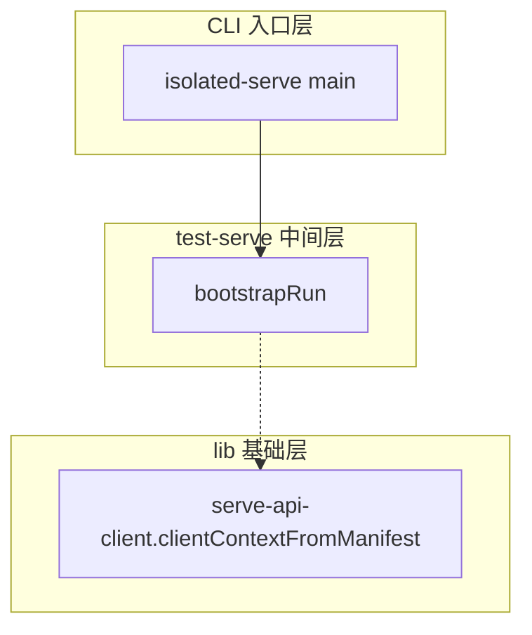

## 用户需求

针对 `scripts/` 下的"可复用核心基础设施"（不含任务专用 ad-hoc 脚本与组件测试），全面梳理函数并以文档形式交付函数清单与函数级调用链拓扑图。

## 产品概述

在 `documents/diagrams/` 下新增 3 份文档：函数清单、分层调用拓扑图、全局调用拓扑图，并同步更新文档索引。所有交付物均为静态代码分析产物，不修改任何源代码。

## 核心功能

- 函数清单：枚举目标文件内全部函数（含导出函数与模块内被调用的内部函数），逐函数记录名称、功能描述、参数、返回值，按子系统/文件分节。
- 分层调用拓扑图：以三层结构（CLI 入口层 → test-serve 生命周期中间层 → lib 基础层）+ sse-daemon 独立子图，用 Mermaid 子图区分层级，实线表直接调用、虚线表间接（传递）调用。
- 全局调用拓扑图：将上述全部函数连通为单一巨图，同样区分直接与间接调用，确保链路完整可追踪。
- 索引同步：在 `documents/INDEX.md` 新增 diagrams/ 条目与阅读建议。

## 技术栈

- 语言/分析对象：TypeScript（ESNext），Bun 运行时
- 静态分析：逐文件 `read_file` + `search_content`（ripgrep）枚举函数与调用点
- 调用验证：`codegraph` MCP（callers/callees）交叉核验关键调用边
- 批量枚举：`code-explorer` 子代理跨多目录扫描
- 图示：`documents/diagrams/` 下 Mermaid `flowchart`（子图分层、实线/虚线区分调用类型）
- 流程约束：`pre-flight-enforcement` skill（pre-flight checklist + 写入完整性闸门）

## 实施方法

通过"枚举函数 → 提取调用边 → 写三类文档"的静态分析流水线完成。关键决策：

1. **目标范围锁定**：仅覆盖可复用基础设施——`scripts/lib/`（serve-api-client.ts、sse-watcher.ts、types.ts）、`scripts/test-serve/`（isolated-serve.ts、run-context.ts、process.ts、bootstrap.ts、execute.ts、cleanup.ts、verify.ts、verify-p01b.ts、oracle.ts、port-reserver.ts、p01b-orchestrator.ts、p02-orchestrator.ts、p02-sentinel.ts、types.ts，排除 `__tests__/`）、通用 CLI（clean-sessions.ts、start-serve.ts、guide.ts、qoder-watcher.ts、deliver-guidance.ts、intervene.ts、session-tree.ts、tree-watcher.ts、monitor-tree.ts）、`sse-daemon.ts`。`types.ts` 的 interface/type 不作为"函数"登记，仅作依赖叶子标注。
2. **函数提取规则**：登记 `export (async)? function`、`export const x = (…)=>`、`class` 方法、以及被其他函数调用的模块内 `function`；忽略未被调用的纯内部工具函数（避免噪声）。
3. **调用边分类**：直接调用 = 函数体中出现被调函数名并实际调用；间接调用 = 通过参数/回调/返回值传递（A→B→C 的传递链）或在子图中以依赖边表示。Mermaid 中实线 `-->` 表直接、虚线 `-.->` 表间接；`subgraph` 区分 CLI 入口层 / test-serve 中间层 / lib 基础层 / sse-daemon 子图，入口函数置顶。
4. **跨文件依赖校验**：对核心入口（isolated-serve 各子命令、runP01b/runP02、bootstrapRun 等）用 `codegraph callers/callees` 验证，弥补人工 ripgrep 遗漏。
5. **性能/可靠性**：单仓库静态分析，复杂度与文件数线性相关；瓶颈在函数与调用边的人工归并，用 code-explorer 批量枚举 + codegraph 验证降低遗漏率。

## 实施注意事项

- 严格遵守 AGENTS.md §11.1 文本产物写入完整性闸门：3 份 .md 串行写入，每文件写后依次 `test -s`、`wc -l`、内容断言（如 `rg -n '^## '`），前一文件通过前不写下一文件。
- 禁止修改任何源码；新文档不得与现有文档体系冲突。
- 直接/间接调用区分需有明确依据（函数体调用 vs 参数传递），不得臆造边。
- 不派遣子代理共享同一批输出文件；主代理在 code-explorer 枚举结果上产出文档。

## 架构设计

```
CLI 入口层 (clean-sessions / start-serve / guide / qoder-watcher / deliver-guidance
           / intervene / session-tree / tree-watcher / monitor-tree / isolated-serve 子命令)
      │ (直接/间接调用)
      ▼
test-serve 生命周期中间层 (create→start→bootstrap→execute→verify→stop→cleanup
           run-context / process / oracle / port-reserver / p01b / p02 / sentinel)
      │ (直接/间接调用)
      ▼
lib 基础层 (serve-api-client: httpJson/getSessionAgent/promptAsync/pollAndReplyQuestionsWithMap
           /waitForIdle/clientContextFromManifest; sse-watcher: SSEWatcherFd/SSEWatcherTail/SSEWatcher)
      ▲
sse-daemon (独立子图，依赖 lib/sse-watcher)
```

## 目录结构

```
documents/
└── diagrams/
    ├── functions-reference.md   # [NEW] 函数清单主文档。按 lib / test-serve / 通用CLI / sse-daemon 分节；
    │                             #       每函数含 名称 / 功能描述 / 参数 / 返回值；含模块内被调用内部函数。
    ├── callgraph-layered.md     # [NEW] 分层 Mermaid 拓扑图。subgraph 区分 CLI入口层、test-serve中间层、
    │                             #       lib基础层、sse-daemon子图；实线直接调用、虚线间接调用；入口置顶。
    └── callgraph-global.md      # [NEW] 单一全局巨图。连通全部函数，区分直接与间接调用，链路完整可追踪。
documents/INDEX.md               # [MODIFY] 新增 diagrams/ 条目、摘要、行数与阅读建议。
```

## 关键代码结构（调用边约定，文档内遵循）



## Agent Extensions

### Skill

- **pre-flight-enforcement**
- Purpose: 约束本次文档产出任务的执行顺序，输出 pre-flight checklist 与 post-execution audit，并对 3 份新建 .md 强制文本产物写入完整性闸门
- Expected outcome: 函数清单与两张调用图按声明顺序产出，每文件写后通过 `test -s` + `wc -l` + 内容断言
- **doc-code-sync**
- Purpose: 在新增 diagrams/ 文档后同步更新 `documents/INDEX.md` 索引（摘要、行数、阅读建议）
- Expected outcome: INDEX.md 准确反映新增文档条目，无遗漏或错位

### SubAgent

- **code-explorer**
- Purpose: 跨 lib/、test-serve/（排除 __tests__）、通用 CLI、sse-daemon.ts 批量枚举全部函数，提取名称/参数/返回值/描述与调用位置
- Expected outcome: 结构化函数清单（文件→函数名→签名→描述），覆盖全部目标文件且无关键遗漏

### MCP

- **codegraph**
- Purpose: 用 callers/callees 交叉验证关键入口与中间函数的调用关系，确认直接/间接调用边
- Expected outcome: 关键调用边经 codegraph 验证，调用链拓扑准确、可追溯，弥补人工 ripgrep 遗漏