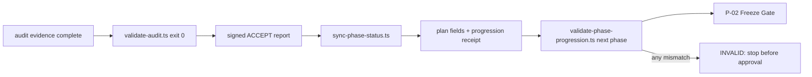

# Blueprint: Phase Progression 审计回写与 Freeze Gate

**创建日期**: 2026-07-24
**更新日期**: 2026-07-28
**状态**: 已完成
**相关蓝图**: 前置依赖 → blueprint-audit-governance-evidence-and-status-closure-v3.md（2026-07-28 已满足）

**版本**: v0.1.0
**日期**: 2026-07-24
**原状态（PHASE-03 前自述）**: 待实施
**优先级**: P0（治理完整性）
**范围**: QoderWork 的 `AGENTS.md`、`deterministic-implementation-planning`、`plan-audit-archiver`、计划校验器、P0-2 回填夹具；不修改 work-one 产品代码。

---

## 一、问题背景

### 1.1 问题描述

当前计划治理声明“未完成 phase 阻断依赖 phase”，但没有可执行的跨 phase 状态闭环。审计 `ACCEPT` 后，agent 可不更新计划 completion gate、phase manifest、顶层状态或下一 phase 的起始条件；下一 phase 的 Freeze Gate 也不会验证这些字段。因此同一计划可以同时出现互相矛盾的状态而不被机器拒绝。

P0-2 是当前可复现夹具：`00-plan-index.md` 顶层仍为 `IN-PROGRESS`，`Only implementation path` 已称 `P0-2 DONE`，manifest 同时存在两条 `PHASE-04`。现有结构 validator 对该目录返回失败，但其 `parseManifest()` 只读取 order、ID、file、dependencies，丢弃第 5 列 `Status`；它并不对状态与 audit 结论建立约束。

### 1.2 根因分析

**直接原因**：

1. `validate-plan.ts` 将 manifest `Status` 作为未解析文本，未检查 completion checkbox、audit `ACCEPT`、顶层状态和下游起始状态的一致性。
2. `plan-audit-archiver` 的 ACCEPT 收尾只要求验收 audit 后归档并更新 `LATEST.md`，没有受控状态回写命令或回写 receipt。
3. `AGENTS.md §15 P-02` 只定义本 phase 的 scope-lock、human approval 与 pre-change receipt，不定义依赖 phase 的 progression admission。

**根本原因**：计划文档的进度仍是人工叙述，而不是由已验签审计结果派生的、可被 Freeze Gate 消费的状态机；现有三个 skill 的责任边界之间没有机器可执行的交接合同。

### 1.3 实测验证

- [VERIFIED] 运行 `/home/zhaoge/.bun/bin/bun run .agents/skills/deterministic-implementation-planning/scripts/validate-plan.ts 'plans/隔离 serve 测试基建待办/p0-2'` 返回 `ok=false`，包含 `DUPLICATE_PHASE_ID`、`DUPLICATE_PHASE_FILE`、`PHASE_ORDER_INVALID` 与 `PHASE_DEPENDENCY_MISMATCH`；这证明 P0-2 可作为回归夹具。
- [VERIFIED] 当前 `validate-plan.ts` 的 `ManifestRow` 没有 `status` 字段，`parseManifest()` 仅从 cells[0]–cells[3] 填充字段。
- [VERIFIED] 当前 `audits/p0-2/LATEST.md` 指向 PHASE-08 `ACCEPT`，而 P0-2 index 顶层仍是 `IN-PROGRESS`。
- [VERIFIED] 当前 CodeGraph 索引属于 qoderwork 主工作树而非本 worktree，故本蓝图的当前分支结论以直接源文件和命令输出为准；实施时必须先建立本 worktree 可用的 CodeGraph 证据或记录同等 `rg` fallback。

**结论**：原回答的核心判断成立；准确表述是“当前不存在强制、可机检的 plan 状态回写与下一 phase admission 流程”，而非“审计不存在任何状态字段”。`pre-flight-enforcement` 不承担跨 phase 计划状态职责。

---

## 二、解决方案

### 2.1 方案对比

| 维度 | A. 只补 skill 文字 | B. 独立 status 文件 | C. 受控回写 + progression validator（选定） |
|---|---|---|---|
| 核心思路 | 要求 agent 自行更新 checklist | 用新 JSON 作唯一状态源 | 以验签 audit 驱动既有计划字段，并生成 receipt；Freeze Gate 运行 validator |
| 自动拒绝漂移 | 无 | 部分，需要再同步文档 | 有，所有镜像字段与 receipt 必须一致 |
| 与现有计划兼容 | 表面兼容，实际不可证明 | 引入第二个易漂移来源 | 保留计划为可读状态面，receipt 为审计证明 |
| 防伪造 ACCEPT | 无 | 无 | sync 重新运行 validator、绑定 audit/report/receipt 哈希 |
| 实现复杂度 | 低 | 中 | 中 |
| 可维护性 | 低 | 中 | 高 |

### 2.2 选择结论

选择方案 C。计划 index/phase 文件保持可审阅的状态面；`sync-phase-status.ts` 是唯一允许把一个 phase 写为 `ACCEPTED` 的路径；`validate-phase-progression.ts` 是进入依赖 phase Freeze Gate 的唯一 admission oracle。`phase-progression` receipt 不是第二个业务状态源，而是对同一批文档字段、被引用 audit 与验证输出的不可变证明。

### 2.3 否决理由

- 方案 A 无法发现 agent 漏写、错写、或把 component 证据提升成 runtime 闭合。
- 方案 B 若没有反向验证计划文本，会增加另一份与 checklist/manifest 可独立漂移的 registry，不能解决根因。

### 2.4 核心状态模型

每个 phase 使用唯一 ID，合法 progression 状态固定为：`NOT_STARTED`、`IN_PROGRESS`、`ACCEPTED`、`BLOCKED`、`INVALID`。`DONE` 仅允许在历史叙述中出现，不能再作为机器字段值。

| 位置 | 机器字段 | 真值约束 |
|---|---|---|
| PLAN_SET index manifest | `Status` | 每行一个唯一 phase；值等于该 phase 文件与 progression receipt 的状态 |
| phase 文件 | `**Progression status**` 与 `**Completion receipt**` | `ACCEPTED` 时 completion gate 必须为 `[x]` 且 receipt 路径/哈希可读 |
| index 顶层 | `**Status**` | 由 manifest 派生：末 phase `ACCEPTED` 为 `COMPLETE`；存在 `IN_PROGRESS` 为 `IN-PROGRESS`；最早可执行 phase `BLOCKED` 为 `BLOCKED`；其余为 `READY-FOR-IMPLEMENTATION` |
| audit archive | `LATEST.md` 和签署报告 | 仅提供 phase audit 结论；不单独证明计划已同步 |
| progression receipt | JSON | 绑定 plan/index SHA-256、phase 文件 SHA-256、audit report SHA-256、`validate-audit` 与 validator 输出哈希、前后状态 |

`ACCEPTED` 必须同时满足：目标 audit report 的 contract verdict 为 `ACCEPT`、`pre-check-evidence.ts` 与 `validate-audit.ts` 都为 exit 0、scope-lock provenance 条件已满足、目标 phase 的依赖均为 `ACCEPTED`、本次写回 receipt 完整可读。任何一个条件不满足，sync 必须 fail-closed，不修改 plan。

### 2.5 运行顺序



---

## 三、核心设计

### 3.1 新增 P-02A：依赖 phase progression admission

在 `AGENTS.md §15`、紧接 P-02 后新增 P-02A。触发点为任意 `v2.1-required` plan 的 next phase 在填写/提交 scope-lock 给 human approval 前。

规则必须固定为：

1. 运行 `validate-phase-progression.ts <plan-dir> <next-phase-id>`；命令 exit 0 是 Freeze Gate 的前置条件。
2. validator 必须验证所有直接与传递依赖 phase 的：签署 `ACCEPT` audit、正确 phase ID、可读 progression receipt、receipt 哈希、phase completion checkbox、phase `Progression status`、index manifest `Status`、派生顶层 `Status` 以及 next phase 的 `Starting state and dependency`。
3. 若任一项缺失、重复、哈希错误、状态不合法、audit 不是 ACCEPT 或状态与派生值不一致，输出稳定 error code 并把 Freeze Gate 判为 `INVALID`；禁止进入 human approval。
4. `component-only` 历史 phase 不得被伪装为 v2.1 ACCEPT；当 dependency 的审计证据上限为 component 时，只能按 index 明确声明的 evidence ceiling 继承，不能提升成 runtime/live 结论。
5. `pre-flight-enforcement` 保持不变：它可约束本次执行顺序，但不得替代 P-02A 或自行写入跨 phase 计划状态。

### 3.2 受控同步命令

新增 `.agents/skills/plan-audit-archiver/scripts/sync-phase-status.ts`：

```text
bun run .../sync-phase-status.ts \
  --plan-dir <plans/.../plan-set> \
  --phase-id PHASE-NN \
  --audit-report <audits/.../signed-accept.md> \
  --audit-dir <audits/...> \
  --receipt-output <audits/.../evidence/phase-progression/PHASE-NN-<generation>.json>
```

命令按以下不可调序顺序执行：

1. 解析 plan，拒绝重复 phase ID/file/order、未知依赖、循环依赖或非法 status。
2. 运行 audit 的 `pre-check-evidence.ts` 与 `validate-audit.ts`；任一非零立即退出且不写文件。
3. 读取 audit contract、scope-lock、`LATEST.md` 和 phase 文件；验证 audit 的 phase identity、`ACCEPT` verdict、provenance/evidence ceiling 与本次 phase 一致。
4. 验证全部依赖已 `ACCEPTED`，计算所有计划字段的 before SHA-256。
5. 以单次受控写入将目标 phase 改为 `ACCEPTED`：勾选其唯一 completion gate、回写 manifest `Status`、更新顶层派生状态；不修改任意历史 audit。
6. 写出 receipt，包含原始/新状态、所有 source path/hash、audit validator command/exit/output hash、sync tool version、UTC 时间和 receipt SHA-256。
7. 重跑 `validate-phase-progression.ts <plan-dir> <phase-id>` 作为 sync 后自检；失败则恢复本次计划文本变更并以非零退出。receipt 只可在自检通过后落盘。

实现不得接受 `--force`、手工 `--status ACCEPTED`、忽略 hash、或“仅更新 manifest”的选项。`ACCEPT` 仍由 human-approved scope-lock + audit validator 共同约束；sync 不能产生或伪造 audit ACCEPT。

### 3.3 Progression validator 与计划 validator 扩展

新增 `.agents/skills/deterministic-implementation-planning/scripts/validate-phase-progression.ts`，将 parsing、状态枚举、派生顶层状态、receipt schema 校验置于 deterministic planning skill 内的纯模块 `.agents/skills/deterministic-implementation-planning/scripts/phase-progression.ts`。两个 CLI 只负责 I/O 和 exit code。

`validate-plan.ts` 必须扩展 `ManifestRow` 为 `{ order, id, file, dependencies, status }`，并新增以下稳定错误码：

| 错误码 | FAIL 条件 |
|---|---|
| `PHASE_STATUS_MISSING` / `PHASE_STATUS_INVALID` | manifest/phase 文件缺字段或不是合法枚举 |
| `PHASE_STATUS_MISMATCH` | manifest 与 phase 文件状态不同 |
| `DUPLICATE_PHASE_ID` / `DUPLICATE_PHASE_FILE` | phase 注册不唯一 |
| `PHASE_COMPLETION_GATE_MISMATCH` | `ACCEPTED` 但 gate 未勾，或未 ACCEPTED 却已勾 |
| `PHASE_AUDIT_ACCEPT_MISSING` | ACCEPTED phase 无可验签的对应 audit |
| `PHASE_RECEIPT_MISSING` / `PHASE_RECEIPT_HASH_MISMATCH` | receipt 不可读或任何绑定 hash 不一致 |
| `TOP_LEVEL_STATUS_MISMATCH` | 顶层状态不是从 manifest 派生的值 |
| `PHASE_STARTING_STATE_MISMATCH` | phase 文件的起始依赖未等于 manifest dependencies |
| `PROGRESSION_DEPENDENCY_NOT_ACCEPTED` | 尝试 admission 时任一依赖未 ACCEPTED |

保留现有结构/大小检查；新检查只处理采用新 progression 标记的 plan。遗留 plan 必须被显式标记为 `progression_schema: legacy`，只允许审计或迁移，不允许开始新的 `v2.1-required` phase。

### 3.4 Skill 与模板变更

| 文件 | 变更 |
|---|---|
| `AGENTS.md` | 新增 P-02A，并在 P-02 Freeze Gate 顺序中引用 admission validator |
| `.agents/skills/plan-audit-archiver/SKILL.md` | ACCEPT 后、更新 `LATEST.md` 前增加不可跳过的 `sync-phase-status.ts` 步骤与 receipt 验证 |
| `.agents/skills/deterministic-implementation-planning/SKILL.md` | 固定 status 枚举、phase completion gate、dependency admission 及 P-02A 命令 |
| `.agents/skills/deterministic-implementation-planning/PLAN-SET-TEMPLATE.md` | 加入 manifest Status、顶层派生状态、每 phase progression/status/receipt 字段 |
| `.agents/skills/deterministic-implementation-planning/PLAN-TEMPLATE.md` | 为 SINGLE_FILE phase 加同等 progression 标记；无 manifest 时以 phase registry 表替代 |
| `.agents/skills/deterministic-implementation-planning/scripts/validate-plan.ts` | 解析 status，实施结构/状态一致性校验 |
| `.agents/skills/deterministic-implementation-planning/scripts/phase-progression.ts` | 新增纯解析、派生、hash contract 与诊断 API |
| `.agents/skills/deterministic-implementation-planning/scripts/phase-progression.test.ts` | 新增纯模块与篡改矩阵单测 |
| 两个 skill 的 scripts test | 覆盖 sync/validator CLI、拒绝路径和零写入保证 |

### 3.5 P0-2 迁移策略

P0-2 是 regression fixture，不能被没有证据的编辑直接“绿化”。迁移必须在新工具存在后执行一次 document-only、scope-locked audit：

1. 先保留失败 fixture，断言旧 index 触发 duplicate/status/progression diagnostics。
2. 建立专用 migration scope-lock，human approval 后捕获 pre-change receipt。
3. 合并重复 `PHASE-04` 为一条可追溯的最终 generation 行；为每个已 ACCEPTED phase 生成回填 progression receipt，且 receipt 逐一绑定已存在、`validate-audit.ts=0` 的最终 audit report。
4. 仅通过 `sync-phase-status.ts --reconcile-existing` 回写 phase gate、manifest status 与顶层 `COMPLETE`；此受限模式只允许无代码变更、全部审计已验签的 legacy plan，禁止对未 ACCEPTED phase 使用。
5. 运行新/旧两个 validator，并保留迁移 audit、receipt 与 P0-2 正/反例测试输出。

---

## 四、子系统合规审计

| # | 子系统 | 状态 | 检查要点 |
|---|---|---|---|
| 1 | MVC Architecture | ✅ | parser/derivation 为纯 lib；CLI 只处理 I/O |
| 2 | DB-only & DB-canonical | ✅ | 不新增业务状态 DB；现有 plan/audit 文件是治理产物 |
| 3 | Permission Matrix | ✅ | 不新增 work-one 工具权限；human scope approval 保持原边界 |
| 4 | Concurrency Safe | ⚠️ | sync 使用临时同目录文件与原子 rename；写前后 hash 防止覆盖并发编辑 |
| 5 | Hardened Enforcement | ✅ | P-02A 在 approval 前 fail-closed，禁止 `--force` |
| 6 | Framework Harness | ✅ | 仅 Bun CLI/fixture，不启动 serve |
| 7 | Central State Management | ✅ | audit ACCEPT 是唯一状态来源；计划字段为受控派生面 |
| 8 | Multi-Agent | ⚠️ | 任何同步前检测计划文件 hash；冲突退出，不重写他人内容 |
| 9 | Log Central Management | ✅ | audit/progression receipts 进入 `audits/<plan>/evidence/` |
| 10 | DB-canonical Management | N/A | 本改动不修改 framework DB/schema |
| 11 | Templatization & Parameterization | ✅ | templates 固定字段、枚举和 CLI 参数，无硬编码计划名 |
| 12 | TypeScript + Bun Runtime | ✅ | TypeScript/Bun；无新增 npm 依赖；新增文件保持 ≤400 行或按职责拆分 |

---

## 五、实施清单

### 5.1 分 phase 实施

**Phase 1 — Contract、P-02A 与模板（component）**

1. 冻结状态枚举、receipt schema、派生算法和错误码。
2. 更新 `AGENTS.md`、两个 skill 与 plan templates。
3. 编写 parser/derivation 的 all-pass 与单一 mutation fixtures。

**Phase 2 — Validator 与受控 sync（component + file integration）**

1. 实现纯 module、`validate-plan.ts` status parsing、`validate-phase-progression.ts`。
2. 实现 `sync-phase-status.ts` 的 audit validation、atomic write、hash receipt 与 rollback。
3. 验证任何失败均不改变计划或覆盖已有 receipt。

**Phase 3 — P0-2 migration 与 admission regression（integration）**

1. 先把当前 P0-2 固化为负夹具。
2. 经专用 v2.1 Freeze Gate 完成 document-only migration，并生成回填 receipts。
3. 验证 PHASE-08 后顶层 `COMPLETE`，以及假设进入新 PHASE-09 时 admission PASS；删/改任一 receipt/hash/status 均必须 FAIL。

### 5.2 固定验证命令

所有命令从 `/home/zhaoge/workspace/qoderwork/.worktrees/check-plan` 执行：

```bash
/home/zhaoge/.bun/bin/bun test ./.agents/skills/deterministic-implementation-planning/scripts/phase-progression.test.ts
/home/zhaoge/.bun/bin/bun test .agents/skills/deterministic-implementation-planning/scripts/validate-plan.test.ts
/home/zhaoge/.bun/bin/bun test .agents/skills/plan-audit-archiver/scripts/sync-phase-status.test.ts
/home/zhaoge/.bun/bin/bun run .agents/skills/deterministic-implementation-planning/scripts/validate-plan.ts <fixture-or-plan-dir>
/home/zhaoge/.bun/bin/bun run .agents/skills/deterministic-implementation-planning/scripts/validate-phase-progression.ts <plan-dir> <next-phase-id>
/home/zhaoge/.bun/bin/bun run typecheck
```

新建/修改 `.agents/skills/deterministic-implementation-planning/scripts/phase-progression.ts` 前必须运行 CodeGraph callers；若当前 worktree 未索引，记录 `rg` fallback，并将全部 caller test 加入固定验证命令。

---

## 六、验证计划

### 6.1 单元测试

- [ ] 合法状态枚举和顶层派生矩阵：READY、IN-PROGRESS、BLOCKED、COMPLETE。
- [ ] manifest parser 保留并验证 Status；重复 ID/file/order 均各自产生一个固定诊断。
- [ ] phase completion gate 与 `ACCEPTED` 的双向一致性。
- [ ] receipt schema/hash/audit hash 任一位篡改时 FAIL。
- [ ] component-only evidence ceiling 不得升级为 runtime/live。

### 6.2 文件集成测试

- [ ] `sync-phase-status.ts` 在有效 ACCEPT audit 上只更新目标 phase 的允许字段，生成可读 receipt。
- [ ] 缺 audit、REWORK/BLOCKED/INVALID audit、validator 非零、依赖未 ACCEPTED、并发 hash 变化时 zero-write。
- [ ] sync 后 progression validator PASS；故意改 manifest/checkbox/top-level/phase start state 各只失败一个指定 check。
- [ ] atomic rename 前的注入失败保留旧计划与无半成品 receipt。

### 6.3 端到端/治理集成验证

- [ ] P0-2 迁移前固定负夹具 FAIL，包含现有 duplicate 与 status drift diagnostics。
- [ ] 经 scope-lock/human approval/pre-change receipt 的迁移后，P0-2 两个 validator 都 PASS，且所有 audit report/receipt hash 可重算。
- [ ] 以 PHASE-09 dry admission fixture 验证 P-02A 在 approval 前拒绝不一致状态、在完整链条上通过。

### 6.4 证据边界

- [ ] 本蓝图交付的证据上限为 component + file integration；不声称 runtime-smoke 或 live-LLM-E2E PASS。
- [ ] 所有 migration 文本写入均按 AGENTS.md §11.1 和 pre-flight 文本完整性闸门串行验证。

---

## 七、风险与缓解

| 风险 | 影响 | 缓解措施 |
|---|---|---|
| 现有 legacy plan 结构多样 | migration 初期被拒绝 | 明确 `legacy` admission 禁止；只给有验签 audit 的计划提供受审计 reconcile 模式 |
| sync 覆盖协作者编辑 | 文档丢失 | 写前/后 hash、临时文件+原子 rename、冲突 fail-closed |
| 把 audit 文本当作 ACCEPT | 伪闭合 | 每次 sync 重跑 audit validator，并绑定 audit/validator output hash |
| 新 validator 太严格阻塞历史阅读 | 不必要的历史改造 | 只将 P-02A 应用于新启动的 v2.1 phase；遗留计划仍可读/审计但不可 admission |
| P0-2 历史证据不完整 | 错误回填 | migration scope-lock 明确每条 report；任一报告不可验签即 BLOCKED，不写状态 |

### 7.1 回滚方案

1. 停止 sync，保留 audit/progression evidence；不得删除失败现场。
2. 对未完成的 sync，因 atomic write 和 hash guard 保持原计划文本；删除仅本次未引用的临时文件。
3. 若已完成但新 validator 有 defect，提交一个 scope-locked document-only revert：恢复受控同步前的 index/phase字段，并保留 receipt 指向的 audit 历史。
4. 不回滚 P-02/P-02A 的 human approval、pre-change 或 signed audit 证据。

## 八、成功标准

- [ ] 新 phase 无法在 dependency phase 未验签/未同步时进入 Freeze Gate。
- [ ] audit ACCEPT 后唯一的状态写入口能生成可验证、哈希绑定的 progression receipt。
- [ ] manifest Status、checkbox、phase status、顶层派生状态与 audit ACCEPT 的任一漂移都会被稳定错误码拒绝。
- [ ] P0-2 从当前负夹具经受审计迁移得到可重复的 COMPLETE 状态；不删除历史 audit。
- [ ] `pre-flight-enforcement` 仍只约束一次任务流程，不承担跨 phase 状态真值。

## 九、参考资料

- `AGENTS.md §15 P-01`、`P-02`、`P-07`
- `.agents/skills/deterministic-implementation-planning/SKILL.md`
- `.agents/skills/deterministic-implementation-planning/scripts/validate-plan.ts`
- `.agents/skills/plan-audit-archiver/SKILL.md`
- `plans/隔离 serve 测试基建待办/p0-2/00-plan-index.md`
- `audits/p0-2/LATEST.md`
