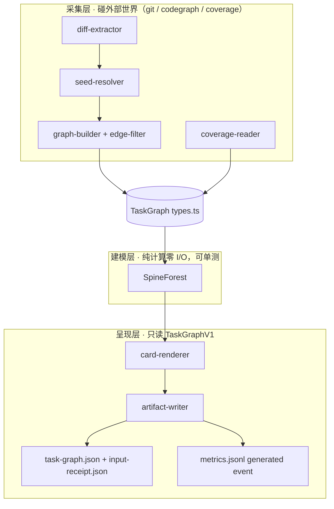

# Blueprint: task-lens M1 —— 任务透镜：AI 任务的函数级理解收据生成器

**创建日期**: 2026-07-23
**更新日期**: 2026-07-28
**状态**: 实施中
**相关蓝图**: 无

**版本**: 0.1.5
**日期**: 2026-07-23
**原状态（PHASE-03 前自述）**: 设计返工已收口，待实施计划冻结
**优先级**: P1

> 读图提示：第一次接触 task-lens，先读「〇、路线图」看全局里程碑与闸门，再读文末「八、设计图纸」（成品 → 过程 → 结构），再读正文。

---

## 〇、路线图（M1 → M2 → M3 + 闸门判定）

本蓝图覆盖 M1 完整设计；M2/M3 只给范围假设与解锁闸门，不代表其技术方案已验证。每个里程碑有前置闸门，未通过则下一里程碑不启动；闸门判定基于 `metrics.jsonl`、版本化 TaskGraph 与 input receipt。红线①-⑤与通用性不变量 G1-G5（见 §2.4.0）跨里程碑恒成立。

| 里程碑 | 范围 | 交付物 | 解锁闸门（判定标准） | verification level |
|--------|------|--------|---------------------|--------------------|
| **M1** | current snapshot diff → 邻域 → 卡片 | `card.md` + `task-graph.json` + `input-receipt.json` + `metrics.jsonl` | ① 10 个真实任务全部完成 feedback 事件 ② ≥7/10 同时标记 `useful=yes` 与 `load_reduced=yes` ③ 第二个已建 CodeGraph 索引的 TS 项目出卡成功且零目标项目写入 ④ `bun test scripts/task-lens` + `bun run typecheck` 全绿 | component + integration + manual verification |
| **M1.5**（可选） | LLM 叙事层 | 自然语言主干叙事替换模板腔 | ① narrative-lint 先建成（叙事每个函数引用必须回溯到 TaskGraph 节点 id） ② M1 feedback 证明模板叙事价值不足 | component |
| **M2** | 录制-重放（待独立 spec） | 候选：CDP 录参/出参、沙箱重跑、receipt、采样调用边 | ① M1 通过其闸门 ② 重新生成耐久 inspector/cpu-prof 证据 ③ 任意模块函数可达性、source map、异步与副作用隔离均有实测 | 未定 |
| **M3** | 画布（待独立 spec） | 读取 M1 的 `task-lens.task-graph/v1` | ① M2 通过其闸门 ② 交互价值数据支撑画布投资 | 未定 |

**闸门纪律**：每个闸门是硬性的，未通过禁止启动下一里程碑。M2/M3 的详细 spec（数据模型、接口、测试）在各自启动前补写，不在本蓝图展开。M2 观测源备选见 §7.3。

---

## 一、问题背景

### 1.1 问题描述

AI 协作开发中，AI 单位时间产出（代码 + 文档）的信息密度远高于人的审查带宽。审查者面对大量产出时无法判断"该主要看什么"，产生心智负担与割裂感；长期表现为知识不沉淀、对产出物失去掌控。

### 1.2 根因分析

**直接原因**：缺少一种按任务维度聚合的、以 diff 为锚点的注意力分配产物。全库调用拓扑规模过大（实测 14,765 条边），原始查询结果还混有 references/import 与低置信度方法解析，人无法直接消费。

**根本原因**：工具链中 codegraph（结构）、bun coverage（行为）、审计收据（证据）各自为政，没有一个按"一次 AI 任务"维度聚合成人可一屏消费形态的缓冲层。瓶颈不在"写"，在"验证"；而验证所需的原料分散在三个未聚合的源里。

### 1.3 实测验证

- **Verified-by**: `codegraph status`（work-one）-> 4,424 nodes / 14,765 edges / 1,349 functions。结论：全库图不适合作为直接人审界面，任务局部图是一个待以 M1 数据验证的候选解。
- **Verified-by**: `codegraph node resolveBaseline` + CodeGraph DB 只读查询 -> `edges.kind` 可区分 `calls/references/imports`；`calls` 的 metadata 含 `confidence/resolvedBy`，`Map.get/set` 可被 0.7 置信度解析到无关方法。结论：必须按边种类过滤并保留 provider 置信度，禁止把所有 static 边视为等价事实。
- **Verified-by**: Bun 1.3.14 隔离测试 `bun test --coverage --coverage-reporter=lcov` -> lcov 有 `FNF/FNH/DA`、无 `FN/FNDA`。结论：Bun 路径必须用 `DA` 行与函数区间求交，不能把 FN/FNDA 当作 M1 前置条件。
- **Verified-by**: 隔离 Git repo -> `git diff HEAD~1` 混入未提交工作区差异，普通 `git diff` 漏掉 untracked，纯删除 hunk 为 `+0,0`。结论：M1 必须定义 change-set 模式、显式纳入 untracked，并单独处理 preimage-only 删除。
- **UNVERIFIED（M2）**: 旧 `/tmp/insp-target.ts` 与 `/tmp/insp-probe2.ts` 已丢失；历史对话中的 inspector 结论不再作为耐久证据。M2 启动前必须把探针、命令、输出与 hash 固化到 evidence 目录并重跑。

**结论**：问题是"验证原料未按任务聚合"，解法是确定性管线把三个已有源聚合成一页任务级理解收据。

---

## 二、解决方案

### 2.1 方案对比

| 维度 | 方案A 全确定性管线 | 方案B 确定性骨架+LLM叙述 | 方案C 纯邻域表 |
|------|------------------|------------------------|--------------|
| 核心思路 | git+codegraph+coverage → 模板渲染 | A 的 TaskGraph → LLM 写叙事 | 砍 spine，只列邻域表 |
| 可信度 | 构造性成立（零 LLM） | 需 narrative-lint 闸门 | 构造性成立 |
| 可复现/可测 | TaskGraph 核心同输入同输出；时间戳隔离在 receipt | 叙事输出不可复现 | 同 A |
| 人审效率 | 模板叙事（够用） | 自然叙事（最好） | 差（数据堆叠） |
| 实现复杂度 | 低 | 中（多 lint+API 依赖） | 最低 |

### 2.2 选择结论

选择**方案 A**。模板叙事的质量风险用 M1 内建的反馈区数据审判，数据证明"读不懂"时才解锁 M1.5（方案 B + narrative-lint：叙事中每个函数引用必须能回溯到 TaskGraph 节点 id）。

### 2.3 否决理由

- 方案 B：引入 LLM 进管线，违反红线①的风险需要额外闸门抵消；M1 阶段复杂度与不可复现性不值得。
- 方案 C：砍掉的主干叙事恰是人审最快的形态，卡片退化为数据堆叠，与要解决的问题同构。

### 2.4 核心设计

#### 2.4.0 通用性不变量

定位：**人在 AI 开发中的函数粒度监测脚手架**——不在乎目标系统的业务，只读函数级元信息与调用链。以下不变量在 M1 即遵守（当下成本≈0，避免未来泛化返工）：

| # | 不变量 | 含义 |
|---|--------|------|
| G1 | 只读语言级产物 | 输入限定为 git diff、代码结构索引、lcov、函数签名——四者皆无业务知识 |
| G2 | 目标项目零侵入 | 目标项目必须预先完成 CodeGraph 索引；task-lens 仅只读，`--out` 必须位于目标项目 realpath 之外 |
| G3 | StructureProvider 接口隔离 | seed/graph 只依赖版本化接口；CodeGraph DB 是首个实现，启动时先做 schema capability probe |
| G4 | 项目差异收敛到显式配置 | `--config <yaml>` 可选；内建安全默认值，项目预设放在 task-lens 自身目录，不写目标项目 |
| G5 | 输入与收据契约版本化 | coverage 输入为 lcov；所有输出绑定 diff/config/coverage/provider hash 与 schema version |

#### 2.4.1 管线总览

```
TaskInputReceipt(project/mode/base/head/diffHash/configHash/coverageHash/provider)
  → diff-extractor: tracked diff + untracked full-file hunks + deleted preimage regions
  → seed-resolver: hunk ∩ current function ranges → live seeds
  → graph-builder: bounded callers/callees + calls-only filter → neighborhood
  → spine: entry search → SpineForest(primaryPath + seedBranches, display≤20)
  → coverage-reader: FN/FNDA or DA∩functionRange → observed/not-observed/unknown
  → artifact-writer: task-graph.json + card.md + input-receipt.json
  → metrics: generated/feedback append events
```

主入口：

```bash
bun run task-lens --project <absolute-git-root> \
  --mode working-tree \
  --out <absolute-dir-outside-project> \
  [--config <yaml>] [--coverage <lcov>]
```

`package.json` 增加 `"task-lens": "bun run scripts/task-lens/cli.ts"`。M1 无服务、零 LLM；持久产物只写 `--out`。

#### 2.4.2 diff-extractor + seed-resolver

M1 只支持两个确定模式，不接受自由形态 `--range`：

| mode | 快照契约 | diff 组成 | 限制 |
|------|----------|-----------|------|
| `working-tree`（默认） | base=`HEAD`，target=当前工作区 | `git diff HEAD`（含 staged+unstaged tracked）+ `git ls-files --others --exclude-standard`（untracked 视为全文件新增） | CodeGraph 必须 up-to-date |
| `commit` | `--base <full-sha>`，head=当前 `HEAD` | `git diff <base>..HEAD` | 工作区必须 clean；M1 拒绝任意历史 head |

- 所有 ref 先解析为 full SHA；拒绝以 `-` 开头的输入，Git 参数以数组传递并使用 `--` 终止选项。
- rename 保留 old/new path 映射。当前快照中的新增/修改 hunk 与 CodeGraph 函数区间求交得 live seeds。
- 纯删除无法从当前索引恢复调用图：记录 `DeletedRegion`（oldPath、preimage range、excerpt hash）并标 `preimage-only`；若任务仅含删除，仍产说明卡并以 degraded exit code 退出，禁止假造 live seed。
- StructureProvider 首选只读 CodeGraph SQLite；启动时验证 `nodes(start_line,end_line,signature)`、`edges(kind,metadata)` 与 schema version。能力不满足则使用 `codegraph node/callers/callees` fallback；两路都不可用则拒绝出卡。

#### 2.4.3 graph-builder + edge-filter

搜索与显示预算分离。图搜索上限：`maxNodes=200`、`maxEdges=500`、`maxFanout=50`；显示上限固定 20。超出搜索预算产 degraded card，明确列出 truncation，不把局部图冒充完整图。

edge-filter 固定顺序：

1. 仅保留 `edges.kind = "calls"`。
2. source/target 仅允许 `{function, method}`，丢弃 references/imports/contains。
3. 丢弃自环与 target 无文件位置的边。
4. 保留 provider `confidence` 与 `resolvedBy`；`confidence < 0.8` 标为 `static-low`，不按 `get/set/map` 名称误杀。
5. 配置仅允许声明入口与副作用 literal token；M1 不接受用户任意正则或自定义 SQL。

#### 2.4.4 spine

- 入口来源：显式 `--entry` > config `entries` > fallback（搜索预算内距离 live seed 最远的 caller）。
- 搜索阶段建立通向每个 seed 的候选路径；呈现阶段生成 `SpineForest`：
  - `primaryPath`：覆盖 seed 数最多、长度最短的路径；
  - `seedBranches`：从 primaryPath 分叉覆盖剩余 seed；
  - `uncoveredSeeds`：受搜索/显示预算限制未覆盖的 seed，必须显式列出。
- 显示节点总数 ≤20；超预算时折叠分支。live seed 超过 20 个时按稳定排序拆成多卡，禁止要求一条简单路径包含全部 seed。

#### 2.4.5 coverage-reader

- 输入为 lcov 文件路径，不绑定生产者。
- 路径 A：存在 `FN/FNDA` 时，以 normalized file + function name + line 组合匹配；同名歧义标 `unknown`。
- 路径 B（Bun 1.3.14）：用 `DA` 记录与函数 `[startLine,endLine]` 求交：
  - 区间内任一 `DA > 0` → `observed`；
  - 区间内存在 DA 且全部为 0 → `not-observed`；
  - 区间内没有 DA → `unknown`。
- coverage receipt 必须记录 producer、文件 hash、mtime 与 target head/diff hash。缺失或无法证明与当前 change-set 对齐时，卡片仍生成但所有观测标 `unknown`，exit code 为 degraded。

#### 2.4.6 card-renderer + 卡片格式

固定五节模板：

```markdown
# 任务透镜卡片 · <task_id> · <change-set>
## 一、主干（SpineForest ≤20 显示节点；未覆盖/低置信度显式标注）
## 二、变更函数表（函数 | 位置 | 签名 | 副作用 | 观测状态）
## 三、副作用表（函数 | DB/FS/NET/PROC | 详情；源码正则启发式，显式标注）
## 四、证据（input/diff/config/coverage/provider hash · edge confidence · UNVERIFIED）
## 五、反馈区（由 feedback 命令写入：useful/load_reduced/issues/review_minutes）
```

每个任务写 `<out>/<task_id>/card.md`、`task-graph.json`、`input-receipt.json`；`task_id` 来自 canonical input hash，不含时间戳。`generated_at` 仅在 receipt 中，renderer 测试注入 clock。

`<out>/metrics.jsonl` 使用追加事件：

- `generated`：task_id、seed/edge/display/coverage/truncation 数据；
- `feedback`：task_id、`useful`、`load_reduced`、`issues_found`、`issues_guided_by_card`、`review_minutes`、notes。

反馈通过 `bun run task-lens feedback --out <dir> --task-id <id> ...` 写入；校验 `issues_guided_by_card <= issues_found`。metrics 写入使用独占 lock、单行 append 与 fsync；artifact 使用同目录临时文件 + rename，禁止覆盖已有 task_id。

副作用检测为源码正则启发式，规则集默认语言级（`node:fs`/`fetch`/`spawn`/`process.env` 等），项目专有模式（如 work-one 的 `dbWrite`）经 `task-lens.config.yaml` 扩展（G4）；卡片显式标"启发式"，不假装精确，符合验证标记纪律。

#### 2.4.7 错误处理（fail-closed）

| 条件 | 行为 |
|------|------|
| codegraph pending / schema capability 不满足且 fallback 不可用 | exit 12，拒绝出卡 |
| diff 为空 | exit 13，不出空卡 |
| 无 live seed / 仅纯删除 | 生成说明卡，exit 2（degraded） |
| coverage 缺失、失配或解析失败 | 生成卡，观测全为 `unknown`，exit 2 |
| 图预算截断 | 生成卡并列出 truncation，exit 2 |
| 参数/配置非法 | exit 10 |
| Git/CodeGraph 子进程失败、超时或输出超限 | exit 20，保留脱敏 stderr 摘要 |
| artifact 原子写入/完整性失败 | exit 21，禁止写 metrics |
| 未分类异常 | exit 1，禁静默 catch |

#### 2.4.8 数据模型（types.ts 核心）

StructureProvider（G3）：seed-resolver 与 graph-builder 只依赖此接口，codegraph 为首个实现：

```typescript
interface StructureProvider {
  readonly metadata: ProviderMetadata;
  getFunctionRanges(files: string[]): Promise<FunctionRange[]>;
  getCallers(ids: string[], budget: GraphBudget): Promise<EdgeRef[]>;
  getCallees(ids: string[], budget: GraphBudget): Promise<EdgeRef[]>;
}
```

```typescript
interface TaskInputReceipt {
  schemaVersion: "task-lens.input/v1";
  taskId: string; projectRealpath: string; mode: "working-tree" | "commit";
  baseSha: string; headSha: string; diffHash: string;
  configHash: string; coverageHash: string | null; provider: ProviderMetadata;
  generatedAt: string;
}
interface FunctionNode {
  id: string; name: string; file: string; startLine: number; endLine: number;
  signature: string; sideEffects: SideEffect[]; observation: Observation;
}
interface CallEdge {
  from: string; to: string; origin: "codegraph-static";
  confidence: number | null; resolvedBy: string | null;
}
interface SpineForest {
  entries: string[]; primaryPath: string[];
  seedBranches: Array<{ from: string; path: string[]; seedIds: string[] }>;
  uncoveredSeeds: string[]; collapsedCount: number;
}
interface TaskGraphV1 {
  schemaVersion: "task-lens.task-graph/v1";
  taskId: string; seeds: string[]; deletedRegions: DeletedRegion[];
  nodes: FunctionNode[]; edges: CallEdge[]; spine: SpineForest;
  truncation: string[]; unverified: string[];
}
```

数组在写出前按稳定 key 排序；禁止把 `Map` 直接 JSON 序列化。M1.5/M3 只能消费该版本化 JSON，不从 markdown 反解析。

#### 2.4.9 命令、路径与资源安全

- Git/CodeGraph 只通过固定 executable + argv 数组调用，`shell: false`；不拼接用户字符串。
- `--project`、`--out`、`--config`、`--coverage` 全部 realpath 化并做边界/符号链接检查；`--out` 位于 project 内即拒绝。
- 子进程默认 timeout 30s、stdout/stderr 各 5 MiB 上限，AbortSignal 取消后终止子进程树。
- 使用最小 env，移除 `NODE_OPTIONS/BASH_ENV/LD_PRELOAD` 等加载行为变量。
- stderr 不等于失败；按 exit code、signal、超时、输出截断和业务 schema 联合判定。

### 2.5 子系统合规审计

本 blueprint 为 qoderwork 本地工具，**不改动 work-one 框架**，多数子系统 N/A：

| # | 子系统 | 状态 | 检查要点 |
|---|--------|------|----------|
| 1 | MVC Architecture | ✅ | CLI 只编排；provider/diff/graph/renderer/artifact 分层 |
| 2 | DB-only & DB-canonical | N/A | 不写 framework DB；CodeGraph DB 仅只读且做 capability probe |
| 3 | Permission Matrix | N/A | 不注册 work-one tool，不改变 agent 权限 |
| 4 | Concurrency Safe | ⚠️ | metrics 必须 lock+append+fsync；artifact 采用临时文件+rename+拒绝覆盖 |
| 5 | Hardened Enforcement | N/A | 不进入 work-one plugin/tool 路径 |
| 6 | Framework Harness | ✅ | 作为 qoderwork CLI 运行；不启动 serve |
| 7 | Central State Management | ✅ | 持久状态仅在显式 `--out`；task_id 绑定全部输入 |
| 8 | Multi-Agent | ✅ | 同 task_id 冲突拒绝，不共享可变内存状态 |
| 9 | Log Central Management | ✅ | 不新增框架日志通道；stdout/stderr + versioned artifacts |
| 10 | DB-canonical Management | N/A | 无 schema/migration 写入 |
| 11 | Templatization & Parameterization | ✅ | project/mode/out/config/coverage/entry 显式参数化；无 per-project 代码分支 |
| 12 | TypeScript + Bun Runtime | ⚠️ | 零新增依赖；Bun 1.3.14 lcov 使用 DA 路径；每个 `.ts` ≤400 行 |

---

## 三、实施清单

### 3.1 文件变更列表

| 序号 | 文件 | 变更类型 | 说明 |
|------|------|---------|------|
| 1 | package.json | 修改 | 增加 `task-lens` script；不新增依赖，不改 bun.lock |
| 2 | scripts/task-lens/types.ts | 新建 | InputReceipt/TaskGraphV1/SpineForest/metrics event 类型 |
| 3 | scripts/task-lens/cli.ts | 新建 | `generate`（默认）/`feedback`/`metrics summarize` 编排 |
| 4 | scripts/task-lens/command-runner.ts | 新建 | 固定 executable、argv、env、timeout、输出上限 |
| 5 | scripts/task-lens/config.ts | 新建 | Bun.YAML 解析、schema 校验、built-in defaults |
| 6 | scripts/task-lens/diff-extractor.ts | 新建 | 两种 mode、untracked、rename、DeletedRegion |
| 7 | scripts/task-lens/codegraph-provider.ts | 新建 | 只读 DB capability probe + CLI fallback |
| 8 | scripts/task-lens/seed-resolver.ts | 新建 | live hunk ∩ current function range |
| 9 | scripts/task-lens/graph-builder.ts | 新建 | bounded calls-only neighborhood + edge metadata |
| 10 | scripts/task-lens/spine.ts | 新建 | SpineForest、拆卡与显示预算 |
| 11 | scripts/task-lens/coverage-reader.ts | 新建 | FN/FNDA 与 DA∩range 两路径 |
| 12 | scripts/task-lens/side-effects.ts | 新建 | 内建规则 + config literal token 扩展 |
| 13 | scripts/task-lens/card-renderer.ts | 新建 | 五节模板，注入 clock |
| 14 | scripts/task-lens/artifact-writer.ts | 新建 | 原子写入、hash、完整性与冲突拒绝 |
| 15 | scripts/task-lens/metrics.ts | 新建 | generated/feedback 事件、lock、summary |
| 16 | scripts/task-lens/presets/work-one.yaml | 新建 | dogfood 入口与副作用 literal token |
| 17 | scripts/task-lens/README.md | 新建 | CLI、配置 schema、exit code、artifact 契约 |
| 18 | scripts/task-lens/__tests__/** | 新建 | 单元、fixture repo、lcov fixture、集成与安全负例 |
| 19 | documents/INDEX.md / logs/INDEX.md | 修改 | 同步文档与日志索引 |

实施 plan 必须在代码写入前另行创建；本蓝图不替代 plan/scope-lock。

### 3.2 实施步骤

**Phase 0: 实施前冻结（阻断条件）**
1. 创建 `plans/task-lens-m1/00-plan-index.md`，声明 `provenance_level: v2.1-required`
2. 审计者填写 scope-lock，Human reviewer 批准
3. `capture-state.ts` 生成并验证 pre-change receipt

**Phase 1: 契约 + 安全入口 + diff（1 天）**
4. types/config/command-runner/cli + TaskInputReceipt
5. diff-extractor 覆盖 working-tree/commit/untracked/rename/delete + 单测

**Phase 2: 结构图 + SpineForest（1 天）**
6. codegraph-provider capability probe + fallback
7. seed/graph/edge metadata + SpineForest + 预算/拆卡测试

**Phase 3: coverage + artifact + feedback（1 天）**
8. coverage-reader 两路径 + side-effects + renderer
9. 原子 artifact、metrics generated/feedback/summary + 快照/并发测试

**Phase 4: 集成与验收启动（0.5 天）**
10. fixture repo + work-one current snapshot 集成验证
11. 第二个已索引 TS 项目零写入验证；启动 10 任务验收周期

---

## 四、验证计划

### 4.1 单元测试
- [ ] diff：working-tree 合并 staged/unstaged/untracked；commit 只接受 current HEAD；rename/delete 语义正确
- [ ] seed：函数外/跨函数/未索引/纯删除 → live seeds 与 DeletedRegion 正确
- [ ] edge：只保留 calls + function/method；保留 confidence/resolvedBy；低置信度不误删
- [ ] spine：环、多入口、分叉 seeds、>20 seeds、预算超限 → forest/拆卡/uncovered 正确
- [ ] coverage：FN/FNDA、Bun DA、同名歧义、无 DA、hash 失配 → 三态正确
- [ ] artifact：canonical sort、Map 禁入、schema version、原子写、同 task_id 冲突拒绝
- [ ] metrics：generated/feedback 校验、并发 lock、summary 门槛
- [ ] command-runner：选项注入、路径逃逸、symlink、timeout、输出超限、危险 env 负例

### 4.2 集成测试
- [ ] fixture repo working-tree → tracked+untracked 出卡，纯删除生成 degraded 说明
- [ ] clean fixture commit base..HEAD → 输出 hash 稳定；dirty commit mode 被拒绝
- [ ] CodeGraph DB schema capability 成功；字段缺失时 CLI fallback；两路失败时 exit 12
- [ ] `--out` 在 project 内、symlink 回 project、artifact 已存在 → 全部拒绝
- [ ] coverage 对齐/失配两条路径 → receipt 与 exit code 正确

### 4.3 人工验证
- [ ] 对 work-one 当前 change-set 出卡，人工核对五节、低置信度边、DeletedRegion 与副作用启发式
- [ ] 第二个已索引 TS 项目出卡；前后 `git status --short` 与内容 hash 不变

### 4.4 子系统合规验证
- [ ] 子系统 4：并发写同 task_id 仅一个成功；metrics 行均可逐行 JSON.parse
- [ ] 子系统 11：除固定 executable allowlist 外，`rg -n "/home/|/tmp/|4097" scripts/task-lens/` 无命中
- [ ] 子系统 12：`git diff -- bun.lock` 为空；`wc -l scripts/task-lens/*.ts` 全部 ≤400
- [ ] provenance：scope-lock、pre-change receipt、EV receipts 与 `validate-audit.ts` 全部通过后才可签署

---

## 五、风险与缓解

### 5.1 风险

| 风险 | 影响 | 缓解措施 |
|------|------|---------|
| Bun lcov 无 FN/FNDA | 无直接函数计数 | 使用 DA∩functionRange 三态；同名/无 DA 明确 unknown |
| CodeGraph 私有 DB schema 漂移 | provider 失败或错边 | capability probe + schema/version receipt + CLI fallback；不可用则拒绝 |
| CodeGraph 低置信度误解析 | 卡片呈现伪调用边 | 保留 confidence/resolvedBy，低置信度显式标注，不按名称误杀 |
| diff 快照歧义/纯删除 | 漏新文件或假造 deleted seed | 固定两种 mode；纳入 untracked；DeletedRegion preimage-only |
| 大图/多 seed 爆炸 | 性能失控或卡片不可读 | 搜索预算、SpineForest、拆卡、degraded exit |
| metrics 并发/反馈错绑 | 门槛数据损坏 | task_id、lock、append+fsync、字段校验与 summary |
| 路径/选项/命令注入 | 越界读取写入或任意执行 | argv、realpath/symlink 边界、最小 env、timeout/output limit |
| 反馈自报偏差 | 效果判断失真 | 固定字段和 7/10 门槛；保留原始事件，不把试点当普遍结论 |
| 模板叙事确实读不懂 | M1 验收失败 | 反馈区数据裁决 → 解锁 M1.5 LLM 叙事层（挂 narrative-lint） |

### 5.2 回滚方案

回滚必须按实施 plan 的精确文件清单执行：删除新增的 `scripts/task-lens/`，移除 `package.json` 的 `task-lens` script，保留 `--out` 下 receipts/metrics 与审计证据。禁止对未解析路径执行递归删除；回滚后运行 `bun run typecheck`、`git diff --check` 与索引一致性检查。

---

## 六、成功标准

- [ ] 10 个真实任务均有 generated + feedback 事件；至少 7 个同时 `useful=yes`、`load_reduced=yes`
- [ ] 第二个已建 CodeGraph 索引的 TS 项目出卡成功，运行前后目标项目 status/hash 不变
- [ ] 每个 task 具备非空且可解析的 `input-receipt.json`、`task-graph.json`、`card.md`
- [ ] TaskGraph canonical 内容在相同输入下 hash 稳定；时间戳仅存在 receipt
- [ ] `bun test scripts/task-lens` 全绿 + `bun run typecheck` 通过
- [ ] 安全负例、预算截断、并发 metrics 与原子写入测试全绿
- [ ] 实施 audit receipts 经 `validate-audit.ts` exit 0
- [ ] M1.5（LLM 叙事层）解锁与否有数据支撑的结论

---

## 七、附录

### 7.1 相关文件
- M1 实施前必须创建：`plans/task-lens-m1/00-plan-index.md` + scope-lock + pre-change receipt
- 下游实施计划固定：`provenance_level: v2.1-required`（M1 以 integration 为硬闸门，不能使用 component-only 上限）
- 旧 `/tmp` inspector 探针不再作为证据；M2 启动前迁移为耐久 fixture/evidence

### 7.2 参考资料
- 设计讨论记录：本会话 2026-07-23（缓冲带构想 → 交互式函数画布 → 契约与 inspector 两问 → 蓝图收敛）
- 参照物：Swagger UI（统一边界+活服务+表单）、Storybook（props 面板）、tRPC（函数签名即契约）
- 红线沉淀：①边只来自确定性工具 ②一屏预算 ≤20 节点 ③声明值/观测值分列 ④交互必出 receipt ⑤产物一次性

### 7.3 M2 运行时观测源备选（2026-07-23 增补调研）

针对"运行时才能确定的元信息"（动态调用边、真实入参出参、异步关联），已调研/实测的获取手段：

| 元信息 | 手段 | 状态 | 精度特性 |
|--------|------|------|---------|
| 调用边（谁调谁） | `bun --cpu-prof` / `--cpu-prof-md` | 历史探针，M2 前须固化重跑 | 有方向+频次；采样制，快函数可能漏采 |
| 执行与否 | `bun test --coverage` lcov | M1 VERIFIED（DA 路径） | 全量但无方向；函数状态由 DA∩range 推导 |
| 真实入参/出参 | CDP `Debugger` 断点读 scopeChain | UNVERIFIED（旧临时探针已丢失） | 任意模块/source map/异步可达性待测 |
| 交互重跑 | CDP `Runtime.evaluate` | UNVERIFIED（仅历史最小探针） | 任意模块函数未证明可达；副作用隔离待设计 |
| 异步边界关联 | `AsyncLocalStorage` trace id | 可用（两运行时） | 需注入；跨 await 传播 |
| 函数级生命周期事件 | `node:diagnostics_channel` TracingChannel（start/end/asyncStart/asyncEnd/error） | Node 实验性（稳定性 1）；Bun 兼容性 UNVERIFIED；需插桩包裹 | 事件可携带参数/返回值，但只覆盖被包裹函数 |

M2 观测源分工初判：调用树=cpu-prof，参数录制=CDP 断点，异步关联=ALS；diagnostics_channel 列为备选（若 Bun 兼容可免断点插桩）。M1 观测层维持 lcov-only 不变（先丑后美纪律）。

---

## 八、设计图纸（新读者先读这里）

三张图按「成品 → 过程 → 结构」排序，各回答一个问题：拿到手的东西长什么样 → 它怎么被造出来 → 谁造的。图一中所有函数名与位置均为 work-one 实测（来自 codegraph 探针），非虚构示例。

### 8.1 图一：成品样例卡

场景：假设某次任务修改了 `resolveBaseline`（baseline.ts:43）。

> 标注纪律：图中函数名/位置/签名来自 codegraph 实测；入口名称与 coverage 数字为示意，用于展示卡片形态。

```markdown
# 任务透镜卡片 · HEAD~1 · 2026-07-23 14:00
## 一、主干
1. [入口] hook:file-write (file-guard/index.ts)
2. → writeSafe (execute.ts:90)
3. → resolveBaseline (baseline.ts:43) ⚠未观测
4. → dbReadFileBaseline (db-state-manager.ts:202)
5. [出口] baseline 命中 → 继续；未命中 → populate 当前 stat 后继续；后续 re-stat 不一致才拒绝
## 二、变更函数
| 函数 | 位置 | 签名 | 副作用 | 观测 |
|---|---|---|---|---|
| resolveBaseline | baseline.ts:43 | (filePath) → Omit<StatSnapshot,"path"> \| null | DB读 | ⚠未观测 |
## 三、副作用表
| 函数 | 类型 | 详情 |
|---|---|---|
| dbReadFileBaseline | DB | 读 framework state DB |
## 四、证据
- coverage: 2/3 函数已观测（bun test, 2026-07-23）· 边来源: codegraph(static)
- UNVERIFIED: resolveBaseline 本次未被测试执行
## 五、反馈区
发现问题数: __ · 其中卡片指引: __ · 耗时: __ min
```

读法：第一节 30 秒知道"从哪进、到哪出"；第二节知道"改了谁"；第三、四节知道"危险点和可信度"；第五节由审查人手填。

### 8.2 图二：流水线（原料在每个工位的形态）

```
git diff HEAD~1
  │ ① hunks    [baseline.ts: 43..55]
  ▼
seed-resolver ─→ ② 种子    [resolveBaseline]
  ▼ +codegraph
graph-builder ─→ ③ 邻域    14 条原始边 →(edge-filter 丢弃 5)→ 9 条
  ▼ +入口注册表
spine ────────→ ④ 主干    hook → writeSafe → resolveBaseline → dbRead → 出口
  ▼ +lcov
coverage-read ─→ ⑤ 观测    resolveBaseline = 未执行
  ▼
card-renderer ─→ 图一那张卡
```

### 8.3 图三：模块分层与纯净度（Mermaid）



读法：只有采集层碰外部世界（确定性工具，红线①）；建模层纯计算，是单测主战场；呈现层只读 TaskGraph，不回头碰采集层——依赖单向，替换任一渲染器（如 M3 画布）不动上游。
