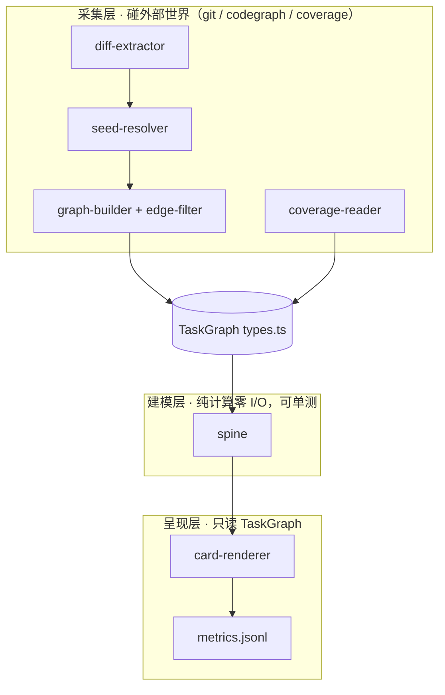

# Blueprint: task-lens M1 —— 任务透镜：AI 任务的函数级理解收据生成器

**版本**: 0.1.4
**日期**: 2026-07-23
**状态**: 待实施
**优先级**: P1

> 读图提示：第一次接触 task-lens，先读「〇、路线图」看全局里程碑与闸门，再读文末「八、设计图纸」（成品 → 过程 → 结构），再读正文。

---

## 〇、路线图（M1 → M2 → M3 + 闸门判定）

本蓝图覆盖 M1 完整设计；M2/M3 在此给出边界与解锁闸门，详细 spec 留待各自启动前补。每个里程碑有前置闸门，未通过则下一里程碑不启动；闸门判定基于 `metrics.jsonl` 与 receipts，不基于主观感觉。红线①-⑤与通用性不变量 G1-G5（见 §2.4.0）跨里程碑恒成立。

| 里程碑 | 范围 | 交付物 | 解锁闸门（判定标准） | provenance 上限 |
|--------|------|--------|---------------------|-----------------|
| **M1** | diff → 邻域 → 卡片 | 五节 markdown 卡 + `metrics.jsonl` | ① 10 真实任务出卡并填反馈区 ② metrics 回看确认减负 ③ 第二 TS 项目出卡成功（G1/G2 实证） ④ `bun test` + `tsc --strict` 全绿 | component+integration |
| **M1.5**（可选） | LLM 叙事层 | 自然语言主干叙事替换模板腔 | ① narrative-lint 先建成（叙事每句函数引用必须回溯到 TaskGraph 节点 id） ② M1 反馈区数据证明模板叙事"读不懂" | component（lint 闸门保证不造边） |
| **M2** | 录制-重放 | CDP `Debugger` 断点录真实入参/出参 + `Runtime.evaluate` 交互重跑 + receipt + cpu-prof 观测边 | ① M1 通过其闸门 ② 沙箱内录制-重放跑通并产出 receipt ③ 交互重跑价值有数据支撑 | component+integration（沙箱） |
| **M3** | 画布 | React Flow 读同一份 TaskGraph JSON | ① M2 通过其闸门 ② 交互价值数据支撑画布投资 | component |

**闸门纪律**：每个闸门是硬性的，未通过禁止启动下一里程碑。M2/M3 的详细 spec（数据模型、接口、测试）在各自启动前补写，不在本蓝图展开。M2 观测源备选见 §7.3。

---

## 一、问题背景

### 1.1 问题描述

AI 协作开发中，AI 单位时间产出（代码 + 文档）的信息密度远高于人的审查带宽。审查者面对大量产出时无法判断"该主要看什么"，产生心智负担与割裂感；长期表现为知识不沉淀、对产出物失去掌控。

### 1.2 根因分析

**直接原因**：缺少一种按任务维度聚合的、以 diff 为锚点的注意力分配产物。全库调用拓扑不可读（实测 14,765 条边），原始调用边含噪声（实测含类型节点、文件级 import 边、内置方法），人都无法直接消费。

**根本原因**：工具链中 codegraph（结构）、bun coverage（行为）、审计收据（证据）各自为政，没有一个按"一次 AI 任务"维度聚合成人可一屏消费形态的缓冲层。瓶颈不在"写"，在"验证"；而验证所需的原料分散在三个未聚合的源里。

### 1.3 实测验证

- **Verified-by**: `codegraph status`（work-one）-> 4,424 nodes / 14,765 edges / 1,349 functions。结论：全库图作为人审界面不可行，任务局部图是唯一可用形态。
- **Verified-by**: `codegraph node resolveBaseline` -> 返回 Location/Signature/带行号源码/Calls/Called-by；其中 Calls 混入 `StatSnapshot`（类型）、`get/set`（内置方法）、`execute.ts:1`（文件级 import 边）。结论：原料可用但必须过滤，edge-filter 是硬需求。
- **Verified-by**: Bun 1.3.14 inspector 探针（`/tmp/insp-probe2.ts`）-> `Runtime.evaluate` 进程外调用活进程函数成功（add(20,22)→42）、`Debugger.enable` 接受；CDP `Profiler` 域缺席，**但** `bun --cpu-prof/--cpu-prof-md` CLI 存在（同日二测：`/tmp/prof-test.ts` -> `.cpuprofile` 含 functionName/children/hitCount 调用树，`.md` 含 Call Tree 与 Called-by 表）。结论：M2 录制/重放原语存在；Bun 观测边有 coverage（执行与否，全量无方向）+ cpu-prof（调用关系+频次，采样制有盲区）两源互补。

**结论**：问题是"验证原料未按任务聚合"，解法是确定性管线把三个已有源聚合成一页任务级理解收据。

---

## 二、解决方案

### 2.1 方案对比

| 维度 | 方案A 全确定性管线 | 方案B 确定性骨架+LLM叙述 | 方案C 纯邻域表 |
|------|------------------|------------------------|--------------|
| 核心思路 | git+codegraph+coverage → 模板渲染 | A 的 TaskGraph → LLM 写叙事 | 砍 spine，只列邻域表 |
| 可信度 | 构造性成立（零 LLM） | 需 narrative-lint 闸门 | 构造性成立 |
| 可复现/可测 | 同输入同输出，全层可单测 | 输出不可复现 | 同 A |
| 人审效率 | 模板叙事（够用） | 自然叙事（最好） | 差（数据堆叠） |
| 实现复杂度 | 低 | 中（多 lint+API 依赖） | 最低 |

### 2.2 选择结论

选择**方案 A**。模板叙事的质量风险用 M1 内建的反馈区数据审判，数据证明"读不懂"时才解锁 M1.5（方案 B + narrative-lint：叙事中每个函数引用必须能回溯到 TaskGraph 节点 id）。

### 2.3 否决理由

- 方案 B：引入 LLM 进管线，违反红线①的风险需要额外闸门抵消；M1 阶段复杂度与不可复现性不值得。
- 方案 C：砍掉的主干叙事恰是人审最快的形态，卡片退化为数据堆叠，与要解决的问题同构。

### 2.4 核心设计

#### 2.4.0 通用性不变量

定位：**人在 AI 开发中的函数粒度监测脚手架**——不在乎目标系统的业务，只读函数级元信息与调用链。以下不变量在 M1 即遵守（当下成本≈0，避免未来泛化返工）：

| # | 不变量 | 含义 |
|---|--------|------|
| G1 | 只读语言级产物 | 输入限定为 git diff、代码结构索引、lcov、函数签名——四者皆无业务知识 |
| G2 | 目标项目零侵入 | 对目标项目只读；只写自己的卡片与 metrics；不要求目标项目改任何代码/配置 |
| G3 | StructureProvider 接口隔离 | seed/graph 的数据来源抽象为接口（见 2.4.8），codegraph 是首个实现，ts-morph 为备选 |
| G4 | 项目差异收敛到配置文件 | `task-lens.config.yaml`（每项目一份）：入口注册、副作用规则扩展、edge-filter 扩展；代码中零 per-project 分支 |
| G5 | 输入契约绑定通用格式 | coverage 输入是 lcov 文件（bun/vitest/jest/c8 均可产出），不绑定具体测试命令 |

#### 2.4.1 管线总览

```
git diff --range → hunk(file,start,end)
  → seed-resolver: hunk ∩ 函数行区间 → 种子函数
  → graph-builder: callers/callees ±2跳 + edge-filter → 邻域
  → spine: 入口注册表匹配 → BFS 主路径(≤20节点,侧枝折叠)
  → coverage-reader: lcov FN/FNDA → 函数级观测状态
  → card-renderer: 五节 markdown + metrics.jsonl 追加
```

单一 CLI 进出：`bun run task-lens [--range HEAD~1] [--entry <name>] [--out <dir>]`。无服务、无状态（除 metrics.jsonl）、零 LLM。

#### 2.4.2 diff-extractor + seed-resolver

- diff-extractor：`git diff --unified=0 <range>` 解析为 hunk 列表（file, startLine, endLine）。
- seed-resolver：函数行区间经 StructureProvider（G3）取自 codegraph 索引。**首选**只读直查 codegraph SQLite（WAL 模式，bun:sqlite 只读连接，一次查询拿变更文件全部 function 节点）；**fallback** 文件内函数声明扫描 + 逐个 `codegraph node`。hunk 与函数区间求交集得种子。
- UNVERIFIED spike（实施第一步）：实测 codegraph SQLite schema 与 bun lcov 输出，fallback 已备。

#### 2.4.3 graph-builder + edge-filter

callers/callees 各 ±2 跳展开邻域。edge-filter 规则集（进 `types.ts` 可配置）：

| 规则 | 丢弃对象 | 依据 |
|------|---------|------|
| R1 | kind ∈ {interface, type_alias, property} 的节点 | 探针实测混入 |
| R2 | location 行号为 1 的文件级边（import 关系） | 探针实测混入 |
| R3 | 无用户文件位置的内置方法（get/set/map 等） | 探针实测混入 |
| R4 | 自环边 | 无信息量 |

#### 2.4.4 spine

- 入口来源：`task-lens.config.yaml` 的 `entries` 字段（G4，每项目一份，≤10 行）+ fallback（取种子最远调用方，零配置可用）。
- M1 附 work-one 预设（test-serve CLI 命令、serve API 路由）作 dogfood；常见栈预设模板（CLI bin/main、bun.serve、Express/Fastify/Hono 路由、测试文件）列入 M1 后可选增强。
- 算法：入口→种子 BFS，多路径按"途经种子数"排序取主路径；硬预算 ≤20 节点，溢出侧枝折叠为计数标注。

#### 2.4.5 coverage-reader

- **模块契约（G5）**：输入为 lcov 文件路径（`--coverage <path>`），不绑定生产者——bun test / vitest / jest / c8 均可产出 lcov。
- 首选消费 lcov 的 FN/FNDA 记录（函数级执行计数，精确匹配需求）。
- fallback：text 表解析，降级为文件级观测，卡片显式标 UNVERIFIED（P-05 降级声明精神）。
- M1 默认采集脚本针对 bun（spike 实测 bun lcov 输出）；其他栈由用户自行提供 lcov 路径即可。

#### 2.4.6 card-renderer + 卡片格式

固定五节模板：

```markdown
# 任务透镜卡片 · <range> · <时间戳>
## 一、主干（≤20 节点编号叙事，入口/出口标注，未观测节点 ⚠）
## 二、变更函数表（函数 | 位置 | 签名 | 副作用 | 观测状态）
## 三、副作用表（函数 | DB/FS/NET/PROC | 详情；源码正则启发式，显式标注）
## 四、证据（coverage x/y 已观测+来源时间戳 · 边=codegraph static · UNVERIFIED 项列明）
## 五、反馈区（审查后手填：发现问题数 / 卡片指引数 / 耗时 min）
```

`metrics.jsonl` 每任务追加一行（range、种子数、主干长度、观测比、反馈三项）。产物一次性，不常驻文档（红线⑤）。

副作用检测为源码正则启发式，规则集默认语言级（`node:fs`/`fetch`/`spawn`/`process.env` 等），项目专有模式（如 work-one 的 `dbWrite`）经 `task-lens.config.yaml` 扩展（G4）；卡片显式标"启发式"，不假装精确，符合验证标记纪律。

#### 2.4.7 错误处理（fail-closed）

| 条件 | 行为 |
|------|------|
| codegraph 有 pending changes | 拒绝出卡，提示 `codegraph sync`（陈旧图=错误边） |
| diff 为空 | 报错退出，不出空卡 |
| 种子为 0（改的是未索引文件/非函数区） | 出"无种子"说明卡 + 专属 exit code |
| coverage 缺失/解析失败 | 卡片照出，观测列标 UNVERIFIED + 原因 |
| 任一模块异常 | 非零退出，禁静默 catch |

#### 2.4.8 数据模型（types.ts 核心）

StructureProvider（G3）：seed-resolver 与 graph-builder 只依赖此接口，codegraph 为首个实现：

```typescript
interface StructureProvider {
  getFunctionRanges(files: string[]): FunctionRange[];  // 函数名/文件/起止行/签名
  getCallers(id: string): Ref[];                        // 含位置，供 edge-filter
  getCallees(id: string): Ref[];
}
```

```typescript
interface FunctionNode { id: string; name: string; file: string;
  startLine: number; endLine: number; signature: string; sideEffects: SideEffect[]; }
type EdgeConfidence = "static" | "observed";
interface CallEdge { from: string; to: string; confidence: EdgeConfidence; }
interface Spine { entries: string[]; mainPath: string[]; collapsed: number; }
interface TaskGraph { range: string; seeds: string[]; nodes: Map<string, FunctionNode>;
  edges: CallEdge[]; spine: Spine; unverified: string[]; }
```

### 2.5 子系统合规审计

本 blueprint 为 qoderwork 本地工具，**不改动 work-one 框架**，多数子系统 N/A：

| # | 子系统 | 状态 | 检查要点 |
|---|--------|------|----------|
| 1-8, 10 | MVC / DB-only / Permission / Concurrency / Hardened / Harness / Central State / Multi-Agent / DB-canonical | N/A | 不触 work-one 运行时、DB、权限与调度 |
| 9 | Log Central Management | ✅ | 输出仅 stdout + `--out` 文件 + metrics.jsonl，不引入新日志通道 |
| 11 | Templatization & Parameterization | ✅ | 路径/range/入口全部参数化，零硬编码（验证计划 4.4 专项 grep） |
| 12 | TypeScript + Bun Runtime | ⚠️ | 零新增 npm 依赖（git/codegraph 为外部 CLI）；文件 ≤400 行；两个 UNVERIFIED spike（bun lcov、codegraph SQLite schema）已备 fallback |

---

## 三、实施清单

### 3.1 文件变更列表

| 序号 | 文件 | 变更类型 | 说明 |
|------|------|---------|------|
| 1 | scripts/task-lens/types.ts | 新建 | TaskGraph/Node/Edge/Spine + edge-filter 规则表 |
| 2 | scripts/task-lens/cli.ts | 新建 | 参数解析与管线编排 |
| 3 | scripts/task-lens/diff-extractor.ts | 新建 | git diff → hunk |
| 4 | scripts/task-lens/seed-resolver.ts | 新建 | hunk ∩ 函数区间 |
| 5 | scripts/task-lens/graph-builder.ts | 新建 | 邻域 + edge-filter |
| 6 | scripts/task-lens/spine.ts | 新建 | 主干提取 |
| 7 | scripts/task-lens/coverage-reader.ts | 新建 | lcov/text 解析 |
| 8 | scripts/task-lens/card-renderer.ts | 新建 | 模板渲染 |
| 9 | scripts/task-lens/metrics.ts | 新建 | jsonl 追加 |
| 10 | scripts/task-lens/task-lens.config.yaml | 新建 | 项目配置：入口注册 + 副作用/edge-filter 扩展（≤15 行） |
| 11 | scripts/task-lens/__tests__/*.test.ts | 新建 | 各模块单测 + 集成 |
| 12 | logs/2026-07-23-task-lens-blueprint.md | 新建 | 本 blueprint 变更日志 |

**修改文件：无。** 零侵入，不触 package.json/tsconfig（scripts/** 已在 tsconfig include 内）。

### 3.2 实施步骤

**Phase 1: spike + 骨架 + diff（0.5 天）**
1. spike：实测 bun lcov FN/FNDA、codegraph SQLite schema → 定型首选/fallback
2. types.ts + cli.ts 参数解析 + diff-extractor + 单测

**Phase 2: 图与主干（1 天）**
3. seed-resolver + graph-builder + edge-filter + 单测
4. spine + task-lens.config.yaml + 单测（含环/多入口/无入口）

**Phase 3: 证据与渲染（0.5~1 天）**
5. coverage-reader + card-renderer + metrics + 快照测试

**Phase 4: 集成与验收启动（0.5 天）**
6. 集成测试（fixture 或 pin work-one 历史 commit range，只读）+ 真实 commit 人工核验
7. 启动 10 任务验收周期，开始积累 metrics.jsonl

---

## 四、验证计划

### 4.1 单元测试
- [ ] diff parser：固定 fixture（多文件/重命名/纯删除）→ hunk 区间正确
- [ ] seed-resolver：hunk 落在函数外/跨两函数/未索引文件 → 种子集合正确
- [ ] edge-filter：含 R1-R4 噪声的合成边列表 → 过滤结果正确
- [ ] spine：合成图（含环、多入口、无入口 fallback、>20 节点）→ 主干合规且含全部种子
- [ ] renderer：固定 TaskGraph → 快照匹配，五节齐全，未观测标 ⚠
- [ ] metrics：多次追加 jsonl 格式合法

### 4.2 集成测试
- [ ] 临时 git repo fixture 或 pin work-one 历史 commit range（只读）→ CLI 端到端出卡，断言预期主干行与种子函数出现
- [ ] codegraph pending changes 状态 → 拒绝出卡并提示 sync
- [ ] 空 diff / 无种子 → 对应 exit code 与说明卡

### 4.3 端到端测试
- [ ] 对最近一次真实 commit 出卡，人工核对五节正确性（主干真实可走通、副作用表无重大漏报）

### 4.4 子系统合规验证
- [ ] 子系统 12：`git diff package.json bun.lock` 为空（零新增依赖）；`wc -l scripts/task-lens/*.ts` 全部 ≤400 行
- [ ] 子系统 11：`rg -n "/home/|/tmp/|4097" scripts/task-lens/` 无命中（零硬编码路径/端口）

---

## 五、风险与缓解

### 5.1 风险

| 风险 | 影响 | 缓解措施 |
|------|------|---------|
| bun 不输出 lcov 函数级 | 观测降级文件级 | Phase 1 spike 实测；fallback + UNVERIFIED 标注 |
| codegraph SQLite schema 不可直读/漂移，或对任意项目建索引能力受限 | seed 解析失败 / 通用性受损 | CLI 逐个 node 查询 fallback（慢但正确）；StructureProvider（G3）隔离后可换 ts-morph 实现 |
| spine 在复杂图（环/大扇出）失真 | 主干不可读 | 20 节点硬预算 + 侧枝折叠 + 集成测试暴露 |
| edge-filter 误杀有效边 | 卡片缺路径 | 规则集可配置 + 快照测试 + E2E 人工核对 |
| 反馈区自报偏差 | 度量失真 | 10 任务后人工回看校准 + 一次无卡对照 |
| 模板叙事确实读不懂 | M1 验收失败 | 反馈区数据裁决 → 解锁 M1.5 LLM 叙事层（挂 narrative-lint） |

### 5.2 回滚方案

`rm -rf scripts/task-lens/` 即完成回滚。零框架改动、零依赖改动、零 DB 改动，回滚成本≈0。metrics.jsonl 与日志保留备查。

---

## 六、成功标准

- [ ] 10 个真实任务出卡并填写反馈区
- [ ] 通用性验证：在第二个 TS 项目（qoderwork scripts 或临时 fixture 项目）出卡成功，且未改动该项目任何文件（G1/G2 实证）
- [ ] metrics.jsonl 回看完成：卡片指引发现问题占比、平均耗时有记录
- [ ] 一次无卡对照主观评估完成
- [ ] `bun test scripts/task-lens` 全绿 + `tsc --noEmit` strict 通过
- [ ] M1.5（LLM 叙事层）解锁与否有数据支撑的结论

---

## 七、附录

### 7.1 相关文件
- 实测探针：`/tmp/insp-target.ts`、`/tmp/insp-probe2.ts`（Bun inspector CDP 验证）
- 下游实施计划 provenance 建议：`component-only`（M1 证据上限为 component+integration，无 live-LLM 依赖）

### 7.2 参考资料
- 设计讨论记录：本会话 2026-07-23（缓冲带构想 → 交互式函数画布 → 契约与 inspector 两问 → 蓝图收敛）
- 参照物：Swagger UI（统一边界+活服务+表单）、Storybook（props 面板）、tRPC（函数签名即契约）
- 红线沉淀：①边只来自确定性工具 ②一屏预算 ≤20 节点 ③声明值/观测值分列 ④交互必出 receipt ⑤产物一次性

### 7.3 M2 运行时观测源备选（2026-07-23 增补调研）

针对"运行时才能确定的元信息"（动态调用边、真实入参出参、异步关联），已调研/实测的获取手段：

| 元信息 | 手段 | 状态 | 精度特性 |
|--------|------|------|---------|
| 调用边（谁调谁） | `bun --cpu-prof` / `--cpu-prof-md` | VERIFIED（本机探针） | 有方向+频次；采样制（实测 1ms 间隔），快函数可能漏采 |
| 执行与否 | `bun test --coverage` lcov | M1 采用 | 全量但无方向 |
| 真实入参/出参 | CDP `Debugger` 断点读 scopeChain | VERIFIED（inspector 探针） | 精确到单次调用；热路径慢，限沙箱使用 |
| 交互重跑 | CDP `Runtime.evaluate` | VERIFIED（inspector 探针） | 进程外调用活进程函数并取值 |
| 异步边界关联 | `AsyncLocalStorage` trace id | 可用（两运行时） | 需注入；跨 await 传播 |
| 函数级生命周期事件 | `node:diagnostics_channel` TracingChannel（start/end/asyncStart/asyncEnd/error） | Node 实验性（稳定性 1）；Bun 兼容性 UNVERIFIED；需插桩包裹 | 事件可携带参数/返回值，但只覆盖被包裹函数 |

M2 观测源分工初判：调用树=cpu-prof，参数录制=CDP 断点，异步关联=ALS；diagnostics_channel 列为备选（若 Bun 兼容可免断点插桩）。M1 观测层维持 lcov-only 不变（先丑后美纪律）。

---

## 八、设计图纸（新读者先读这里）

三张图按「成品 → 过程 → 结构」排序，各回答一个问题：拿到手的东西长什么样 → 它怎么被造出来 → 谁造的。图一中所有函数名与位置均为 work-one 实测（来自 codegraph 探针），非虚构示例。

### 8.1 图一：成品样例卡

场景：假设某次任务修改了 `resolveBaseline`（baseline.ts:43）。

> 标注纪律：图中函数名/位置/签名来自 codegraph 实测；入口名称与 coverage 数字为示意，用于展示卡片形态。

```markdown
# 任务透镜卡片 · HEAD~1 · 2026-07-23 14:00
## 一、主干
1. [入口] hook:file-write (file-guard/index.ts)
2. → writeSafe (execute.ts:90)
3. → resolveBaseline (baseline.ts:43) ⚠未观测
4. → dbReadFileBaseline (db-state-manager.ts:202)
5. [出口] baseline 命中 → 继续写入 / 未命中 → 拒绝
## 二、变更函数
| 函数 | 位置 | 签名 | 副作用 | 观测 |
|---|---|---|---|---|
| resolveBaseline | baseline.ts:43 | (filePath) → Omit<StatSnapshot,"path"> \| null | DB读 | ⚠未观测 |
## 三、副作用表
| 函数 | 类型 | 详情 |
|---|---|---|
| dbReadFileBaseline | DB | 读 framework state DB |
## 四、证据
- coverage: 2/3 函数已观测（bun test, 2026-07-23）· 边来源: codegraph(static)
- UNVERIFIED: resolveBaseline 本次未被测试执行
## 五、反馈区
发现问题数: __ · 其中卡片指引: __ · 耗时: __ min
```

读法：第一节 30 秒知道"从哪进、到哪出"；第二节知道"改了谁"；第三、四节知道"危险点和可信度"；第五节由审查人手填。

### 8.2 图二：流水线（原料在每个工位的形态）

```
git diff HEAD~1
  │ ① hunks    [baseline.ts: 43..55]
  ▼
seed-resolver ─→ ② 种子    [resolveBaseline]
  ▼ +codegraph
graph-builder ─→ ③ 邻域    14 条原始边 →(edge-filter 丢弃 5)→ 9 条
  ▼ +入口注册表
spine ────────→ ④ 主干    hook → writeSafe → resolveBaseline → dbRead → 出口
  ▼ +lcov
coverage-read ─→ ⑤ 观测    resolveBaseline = 未执行
  ▼
card-renderer ─→ 图一那张卡
```

### 8.3 图三：模块分层与纯净度（Mermaid）



读法：只有采集层碰外部世界（确定性工具，红线①）；建模层纯计算，是单测主战场；呈现层只读 TaskGraph，不回头碰采集层——依赖单向，替换任一渲染器（如 M3 画布）不动上游。
