# 可复用核心基础设施 — 单一全局调用链拓扑图

> 将 `functions-reference.md` 的全部可复用函数置于 **一张** Mermaid 图中，连通全部调用链。实线 `-->` = 直接调用，虚线 `-.->` = 间接调用（传递 / spawn / 参数注入）。
> 为可读性，按文件分组为 subgraph；这是**同一张图**内的分组，节点 ID 可跨组连线。

## 图例

- 实线 `-->`：直接调用　虚线 `-.->`：间接调用
- 分组：`iso`=isolated-serve / `r01b`=p01b-orchestrator / `r02`=p02-orchestrator / `bs`=bootstrap / `pr`=process / `ex`=execute / `cl`=cleanup / `or`=oracle / `rc`=run-context / `v1`=verify-p01b / `v2`=verify-p02 / `sn`=p02-sentinel / `prt`=port-reserver / `sac`=serve-api-client / `sse`=sse-watcher / `cli`=通用 CLI / `daemon`=sse-daemon

```mermaid
flowchart TD
  subgraph iso[isolated-serve]
    iso_main["main"]
    iso_req["requiredArg"]
    iso_get["getArg"]
    iso_has["hasFlag"]
    iso_tail["collectTailArgs"]
    iso_help["printHelp"]
  end

  subgraph r01b[p01b-orchestrator]
    r01b_run["runP01b"]
    r01b_val["validateInput"]
    r01b_can["canVerifyRunProcesses"]
    r01b_wr["defaultWriteStageResults"]
    r01b_vrp["defaultValidateRunProcess"]
  end

  subgraph r02[p02-orchestrator]
    r02_run["runP02"]
    r02_val["validateInput"]
    r02_wr["defaultWriteStageResults"]
    r02_obs["defaultObserveCleanupB"]
    r02_pid["isPidAlive"]
    r02_db["ensureFrameworkDb"]
  end

  subgraph bs[bootstrap]
    bs_run["bootstrapRun"]
    bs_wsb["waitForSessionBarrier"]
    bs_lps["loadPrivilegeService"]
    bs_crt["createSession"]
    bs_wre["withRunEnvironment"]
    bs_agb["assertGrantBound"]
    bs_nap["normalizeAllowedPaths"]
    bs_cef["checkEventFile"]
    bs_csm["checkSessionMap"]
    bs_csd["checkSdkDbParent"]
  end

  subgraph pr[process]
    pr_srp["startRunProcesses"]
    pr_insp["inspectRunProcesses"]
    pr_stp["stopRunProcesses"]
    pr_marker["readValidSseReadyMarker"]
    pr_valp["validateRunProcess"]
    pr_bin["resolveOpencodeBin"]
    pr_wh["waitForHealth"]
    pr_crh["canReachHealth"]
    pr_we["waitForExit"]
    pr_sleep["sleep"]
    pr_pl["isPortListening"]
  end

  subgraph ex[execute]
    ex_run["executeRun"]
  end

  subgraph cl[cleanup]
    cl_run["cleanupRun"]
  end

  subgraph or[oracle]
    or_open["openReadonly"]
    or_find["findSessionEvent"]
    or_sdk["sdkSessionExists"]
    or_map["sessionMapExists"]
    or_grantE["grantExists"]
    or_grantB["grantBoundTo"]
  end

  subgraph rc[run-context]
    rc_ctx["createRunContext"]
    rc_read["readRunManifest"]
    rc_write["writeRunManifest"]
    rc_state["setRunState"]
    rc_spawn["spawnPortReserver"]
    rc_rel["releasePortReservation"]
    rc_snap["snapshotSourceOverlay"]
    rc_valo["validateSourceOverlay"]
    rc_apply["applySourceOverlay"]
    rc_sha["sha256File"]
    rc_arch["archiveFrameworkLogs"]
    rc_mid["makeRunId"]
    rc_paths["createRunPaths"]
    rc_dirs["ensureRunDirectories"]
    rc_def["getDefaultPrimaryWorktree"]
    rc_stateroot["getStateRoot"]
    rc_env["buildRunEnvironment"]
    rc_resolve["resolveRequiredDir"]
    rc_portok["ensurePortAvailable"]
    rc_ready["waitForReadyLine"]
    rc_exit["waitForProcessExit"]
    rc_git["git"]
    rc_ovr["readOverlayManifest"]
    rc_clean["cleanupFailedCreate"]
    rc_tar["readTarEntries"]
  end

  subgraph v1[verify-p01b]
    v1_run["verifyP01b"]
    v1_rt["checkRuntimeChecks"]
    v1_cl["checkCleanupChecks"]
    v1_qp["querySdkDbParent"]
  end

  subgraph v2[verify-p02]
    v2_run["verifyP02"]
    v2_alive["isProcessAlive"]
    v2_sent["readSentinelAlive"]
    v2_start["startChecksAllTrue"]
    v2_safe["safeReadManifest"]
    v2_mid["markerIdentityOk"]
    v2_qt["queryTriState"]
    v2_tbl["tableAvailable"]
    v2_sdks["sdkSessionState"]
    v2_maps["sessionMapState"]
    v2_grs["grantState"]
    v2_evr["eventsReadable"]
    v2_evs["eventSessionState"]
    v2_path["pathContained"]
    v2_port["defaultPortOwnerReader"]
  end

  subgraph sn[p02-sentinel]
    sn_start["startSentinel"]
    sn_stop["stopSentinel"]
    sn_vid["validateSentinelIdentity"]
    sn_fin["finalizeSentinelMarker"]
  end

  subgraph prt[port-reserver]
    prt_main["main"]
    prt_grace["gracefulShutdown"]
  end

  subgraph sac[lib/serve-api-client]
    sac_http["httpJson"]
    sac_agent["getSessionAgent"]
    sac_prompt["promptAsync"]
    sac_def["defaultReplier"]
    sac_poll["pollAndReplyQuestionsWithMap"]
    sac_idle["waitForIdle"]
    sac_ctx["clientContextFromManifest"]
  end

  subgraph sse[lib/sse-watcher]
    sse_w["SSEWatcher"]
    sse_fd["SSEWatcherFd"]
    sse_tail["SSEWatcherTail"]
  end

  subgraph cli[独立 CLI 叶子]
    cli_cs["clean-sessions.main"]
    cli_ss["start-serve.main"]
    cli_gu["guide.main"]
    cli_qw["qoder-watcher.main"]
    cli_dg["deliver-guidance.main"]
    cli_iv["intervene.main"]
    cli_st["session-tree.main"]
    cli_tw["tree-watcher.main"]
    cli_mt["monitor-tree.main"]
  end

  subgraph daemon[sse-daemon]
    d_main["main"]
    d_ev["ensureEventFile"]
    d_mk["writeSseReadyMarker"]
    d_log["log"]
    d_rel["isRelevant"]
    d_arch["archiveIfNeeded"]
    d_map["autoWriteSessionMap"]
    d_app["appendEvent"]
    d_conn["connectSSE"]
  end

  %% ---- 入口连线 ----
  iso_main --> iso_req & iso_get & iso_has & iso_tail & iso_help
  iso_main --> r01b_run
  iso_main --> bs_run & ex_run & pr_srp & pr_stp & pr_insp & cl_run & v1_run
  iso_main --> rc_ctx & rc_snap & rc_def

  %% ---- p01b 编排 ----
  r01b_run --> r01b_val & r01b_can & r01b_wr & r01b_vrp
  r01b_run --> bs_run & ex_run & pr_srp & pr_stp & cl_run & v1_run & rc_ctx

  %% ---- p02 编排 ----
  r02_run --> r02_val & r02_wr & r02_obs & r02_pid & r02_db
  r02_run --> sn_start & sn_stop & sn_vid & sn_fin
  r02_run --> bs_run & ex_run & pr_srp & pr_stp & cl_run & v2_run & rc_ctx

  %% ---- bootstrap ----
  bs_run --> bs_wsb & bs_lps & bs_crt & bs_agb & bs_nap & pr_stp
  bs_run --> rc_read & rc_write & rc_state
  bs_wsb --> bs_cef & bs_csm & bs_csd
  bs_lps --> bs_wre

  %% ---- process ----
  pr_srp --> rc_read & rc_write & rc_state & rc_spawn & pr_valp & pr_wh & pr_pl
  pr_stp --> rc_read & rc_state & pr_we & pr_valp
  pr_insp --> rc_read
  pr_wh --> pr_crh
  pr_srp -.-> prt_main
  rc_spawn -.-> prt_main
  rc_rel -.-> prt_main

  %% ---- execute / cleanup ----
  ex_run --> rc_read & rc_state
  cl_run --> rc_read & rc_write & rc_state & rc_arch

  %% ---- oracle ----
  or_find --> or_open
  or_sdk --> or_open
  or_map --> or_open
  or_grantE --> or_open
  or_grantB --> or_open

  %% ---- verify-p01b ----
  v1_run --> rc_read & or_find & or_sdk & or_map & or_grantB & v1_rt & v1_cl & v1_qp

  %% ---- verify-p02 ----
  v2_run --> rc_read & or_grantB & v2_alive & v2_sent & v2_start & v2_safe & v2_mid & v2_qt & v2_tbl & v2_sdks & v2_maps & v2_grs & v2_evr & v2_evs & v2_path & v2_port
  v2_qt --> or_open
  v2_tbl --> or_open
  v2_sdks --> or_open
  v2_maps --> or_open
  v2_grs --> or_open

  %% ---- run-context 基础内部边 ----
  rc_ctx --> rc_mid & rc_paths & rc_dirs & rc_env & rc_ovr & rc_apply & rc_write & rc_state & rc_spawn & rc_git & rc_resolve & rc_clean & rc_valo
  rc_state --> rc_write
  rc_spawn --> rc_portok & prt_main & rc_ready
  rc_rel --> pr_exit & rc_sleep
  rc_snap --> rc_resolve & rc_git & rc_sha & rc_tar & rc_valo & rc_ovr
  rc_valo --> rc_resolve & rc_ovr & rc_sha & rc_tar
  rc_apply --> rc_ovr & rc_git
  rc_sha --> rc_tar
  rc_arch --> rc_dirs

  %% ---- lib 子系统（仅被排除脚本消费） ----
  sac_agent --> sac_http
  sac_prompt --> sac_agent & sac_http
  sac_def --> sac_poll
  sac_poll --> sac_http
  sac_idle --> sse_w
  sse_w --> sse_fd & sse_tail

  %% ---- sse-daemon 内部 ----
  d_main --> d_ev & d_mk & d_log & d_rel & d_arch & d_map & d_app & d_conn

  %% ---- 独立 CLI 叶子：无 in-scope 调用边 ----
  cli_cs & cli_ss & cli_gu & cli_qw & cli_dg & cli_iv & cli_st & cli_tw & cli_mt
```

## 跨组关键调用链（可读性摘要）

1. **主入口全链路**：`iso_main → {bs_run, ex_run, pr_srp, pr_stp, pr_insp, cl_run, v1_run, rc_ctx, rc_snap}`
2. **P01B**：`iso_main → r01b_run → bs_run → ex_run → pr_srp → (pr_stp) → v1_run → cl_run`，其中 `bs_run → bs_wsb → {bs_cef,bs_csm,bs_csd}`、`v1_run → {or_find,or_sdk,or_map,or_grantB}`。
3. **P02**：`r02_run → {sn_start(+sn_stop/sn_vid/sn_fin), bs_run, ex_run, pr_srp, cl_run, v2_run}`，`v2_run → 多 oracle tri-state 读取簇`。
4. **基础层汇聚**：`rc_ctx` 是所有 run 创建的扇入点；`rc_read/rc_write/rc_state` 被生命周期各模块广泛调用；`rc_spawn/rc_rel` 经 `spawn` 拉起/释放 `port-reserver`（虚线）。
5. **lib 孤立**：`sac_*` ↔ `sse_*` 自连，对外仅被排除脚本消费（图中无到 test-serve/CLI 的实线）。
6. **独立叶子**：9 个 CLI `main` + `sse-daemon.main` 互无调用边，仅节点陈列。
