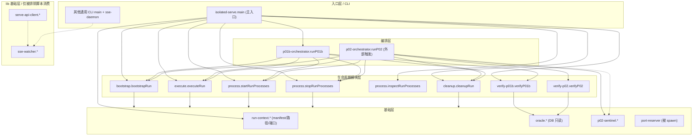
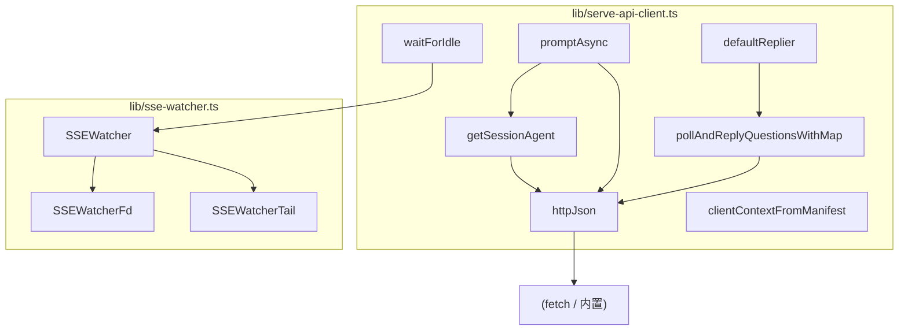
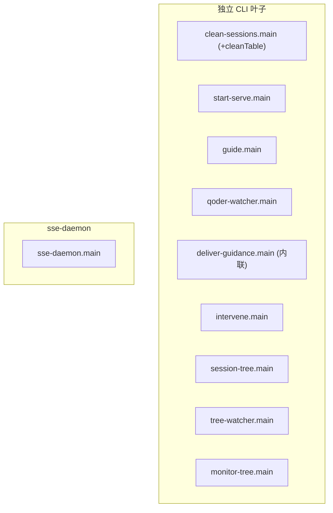

# 可复用核心基础设施 — 分层调用链拓扑图

> 配合 `functions-reference.md` 阅读。本图按子系统/层级分组，实线 `-->` = 直接调用，虚线 `-.->` = 间接调用（传递链 / spawn / 参数注入）。
> 关键修正：in-scope 复用基础设施由 **3 个互不相连子图** 组成（详见 `functions-reference.md` §0），因此"单一三层链"不成立；本图如实分层与分组。

## 图例

- 实线 `-->`：A 函数体内显式调用 B（直接）
- 虚线 `-.->`：A→B→C 的传递（间接），或经由 spawn 子进程 / 回调参数注入
- 节点命名：`文件缩写::函数`，如 `iso::main` = `isolated-serve.ts#main`
- 颜色分组：入口（红框）/ 编排（橙）/ 生命周期模块（蓝）/ 基础（绿）/ lib（紫）/ 独立叶子（灰）

---

## 1. 主分层总览（三层 + lib + 独立叶子）

> 说明：
> - `runP02` 不在 `isolated-serve` 命令集中，仅供外部 harness/排除脚本触发（虚线 `-.->` 表示可达但非主入口直连）。
> - `port-reserver` 由 `run-context#spawnPortReserver` 经 `spawn` 拉起，故为虚线依赖。
> - `lib` 子图与 test-serve / CLI 无 import 关系，仅 `cli_leaves` 经外联 `fetch` 直连 serve（不在 import 图内）。

---

## 2. test-serve 子系统详图（核心调用链）

```mermaid
flowchart TD
  subgraph ENTRY[入口 / 编排]
    iso_main["isolated-serve.main"]
    r01b["runP01b"]
    r02["runP02"]
  end

  subgraph LIFE[生命周期模块]
    boot["bootstrapRun"]
    wsb["waitForSessionBarrier"]
    lps["loadPrivilegeService"]
    crt["createSession"]
    exec["executeRun"]
    srp["startRunProcesses"]
    stp["stopRunProcesses"]
    insp["inspectRunProcesses"]
    cln["cleanupRun"]
    vp1b["verifyP01b"]
    vp2["verifyP02"]
  end

  subgraph BASE[基础层]
    rc_ctx["run-context.createRunContext"]
    rc_read["run-context.readRunManifest"]
    rc_write["run-context.writeRunManifest"]
    rc_state["run-context.setRunState"]
    rc_spawn["run-context.spawnPortReserver"]
    rc_rel["run-context.releasePortReservation"]
    rc_snap["run-context.snapshotSourceOverlay"]
    or_find["oracle.findSessionEvent"]
    or_sdk["oracle.sdkSessionExists"]
    or_map["oracle.sessionMapExists"]
    or_grant["oracle.grantBoundTo"]
    sn_start["sentinel.startSentinel"]
    sn_stop["sentinel.stopSentinel"]
    sn_vid["sentinel.validateSentinelIdentity"]
    sn_fin["sentinel.finalizeSentinelMarker"]
  end

  iso_main --> boot & exec & srp & stp & insp & cln & vp1b & rc_ctx & rc_snap
  r01b --> boot & exec & srp & stp & cln & vp1b & rc_ctx
  r02 --> boot & exec & srp & stp & cln & vp2 & sn_start & sn_stop & sn_vid & sn_fin & rc_ctx

  boot --> wsb & lps & crt & stp & rc_read & rc_write & rc_state
  wsb --> cef & csm & csd
  lps --> wre
  exec --> rc_read & rc_state
  srp --> rc_read & rc_write & rc_state & rc_spawn
  stp --> rc_read & rc_state
  insp --> rc_read
  cln --> rc_read & rc_write & rc_state & arc

  vp1b --> rc_read & or_find & or_sdk & or_map & or_grant & crt1 & crt2 & crt3
  vp2 --> rc_read & or_grant & vp2a & vp2b & vp2c

  rc_ctx --> rc_spawn & rc_write & rc_state
  rc_state --> rc_write
  rc_spawn -.-> prt["port-reserver (spawn)"]
  rc_rel -.-> prt
```

> 缩写说明（同文件内私有辅助，未全部展开以免过载）：
> - `cef/cef/csm/csd` = bootstrap 的 `checkEventFile/checkSessionMap/checkSdkDbParent`
> - `wre` = bootstrap 的 `withRunEnvironment`
> - `arc` = run-context 的 `archiveFrameworkLogs`
> - `crt1/crt2/crt3` = verify-p01b 的 `checkRuntimeChecks/checkCleanupChecks/querySdkDbParent`
> - `vp2a/vp2b/vp2c` = verify-p02 内部 tri-state 读取簇（`sdkSessionState/sessionMapState/grantState` 等）

---

## 3. lib 子系统图（serve-api-client ↔ sse-watcher）

> 注：`lib` 子系统仅被排除的 `_b*` / `live-*` 脚本 import（通过 `clientContextFromManifest`/`waitForIdle`/`promptAsync` 等参与真实 E2E），不在 in-scope 复用基础设施的 import 图中。

---

## 4. 独立 CLI 叶子 + sse-daemon（无内部依赖，仅说明性）

以下节点**不依赖 lib 或 test-serve**，各自通过内联 `fetch` / `bun:sqlite` 直连 serve 或 DB；彼此无调用边，故仅列节点：

> 各 `main` 内部调用其私有辅助（见 `functions-reference.md` §16），但均不跨文件调用 lib/test-serve，因此不构成 in-scope 调用边。
