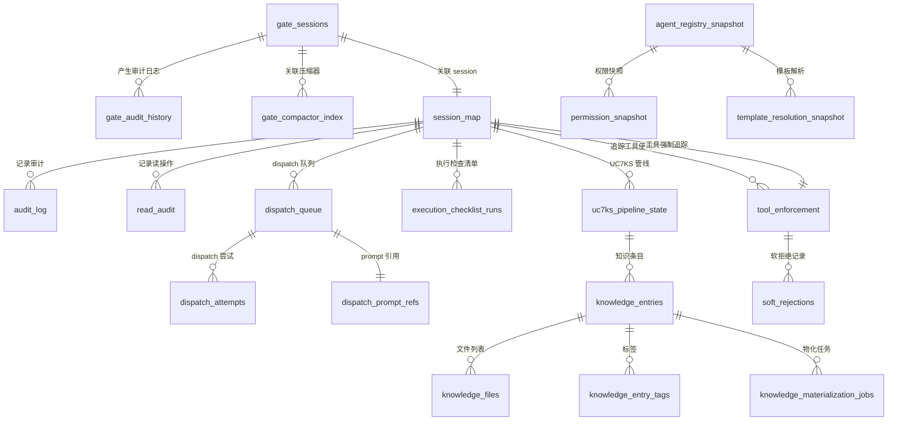

# OpenCode 框架 DB-only & DB-Canonical 设计深度解析

> **版本**: v1.0.0
> **生成日期**: 2026-07-03 | 基于 work-one 项目实际代码分析
> **目的**: 完整阐述 OpenCode 框架的 DB-only 和 DB-canonical 设计理念、数据模型架构、表关系与业务关联

---

## 目录

1. [设计理念概述](#一设计理念概述)
2. [数据库全景架构](#二数据库全景架构)
3. [核心数据模型详解](#三核心数据模型详解)
4. [表关系与业务关联](#四表关系与业务关联)
5. [DB-Canonical 设计证据](#五db-canonical-设计证据)
6. [数据库迁移机制](#六数据库迁移机制)
7. [关键代码索引](#七关键代码索引)

---

## 一、设计理念概述

### 1.1 DB-only 设计

**核心理念**: 所有框架状态统一存储到数据库，不再依赖文件系统状态。

**设计目标**:
- **单一真相源**: 数据库是状态的唯一权威来源
- **可查询性**: 支持复杂查询（JOIN、聚合、索引）
- **并发安全**: SQLite 提供 ACID 事务保证
- **可审计性**: 所有状态变更都有审计日志

**实施路径**:
```
阶段 1: Dual-Write（双写）
  - 同时写入数据库和 JSON 文件
  - 数据库为主，文件为备

阶段 2: DB-Canonical（数据库规范化）
  - 数据库为唯一真相源
  - JSON 文件作为导出缓存
  - 支持从数据库重新生成 JSON 文件

阶段 3: 移除文件依赖（进行中）
  - 逐步移除对 JSON 文件的读取
  - 完全依赖数据库
```

### 1.2 DB-canonical 设计

**核心原则**:
1. **数据库是规范化的真相源** (Database is Canonical)
2. **JSON 文件是导出缓存** (JSON files are export caches)
3. **可以随时重新生成** (Regenerable from DB)

**关键证据**:
- `dbRegenerateGateFiles()` 函数：从数据库重新生成所有 Gate 状态文件
- 所有 JSON 文件都有对应的数据库表
- 数据库迁移系统确保模式演进的完整性

---

## 二、数据库全景架构

### 2.1 数据库基本信息

| 属性 | 值 |
|------|-----|
| **数据库文件** | `.opencode/state/framework-state.db` |
| **数据库引擎** | SQLite (via `bun:sqlite`) |
| **表数量** | 50 表（截至 schema version 37；54 个 CREATE TABLE - 4 个 DROP TABLE） |
| **迁移版本** | v37（2026-07 当前） |

### 2.2 数据模型分类（9 大类）

```
┌─────────────────────────────────────────────────────────────────┐
│                    OpenCode 数据库架构全景                        │
└─────────────────────────────────────────────────────────────────┘

1. 核心状态管理 (Core State Management)
   ├── machine_meta
   ├── machine_contracts
   └── substate_kv

2. Gate/合规管理 (Gate/Compliance)
   ├── gate_sessions
   ├── gate_drained_sessions
   ├── gate_session_index
   ├── gate_store_meta
   ├── gate_audit_history
   └── gate_compactor_index

3. Session 管理 (Session Management)
   ├── session_map
   └── session_log

4. 审计与日志 (Audit & Logging)
   ├── audit_log
   ├── audit_trail
   └── read_audit

5. Dispatch 系统 (Dispatch System)
   ├── dispatch_queue
   ├── dispatch_prompt_refs
   ├── dispatch_attempts
   ├── dispatch_failed_log
   └── dispatch_payload_integrity

6. P0 检查清单 (P0 Checklist)
   ├── execution_checklist_runs
   ├── execution_checklist_items
   └── execution_checklist_events

7. 知识/UC7KS 管线 (Knowledge/UC7KS Pipeline)
   ├── uc7ks_pipeline_state
   ├── knowledge_entries
   ├── knowledge_files
   ├── knowledge_entry_tags
   ├── knowledge_materialization_jobs
   └── knowledge_session_access_archive

8. 配置快照 (Configuration Snapshot)
   ├── permission_snapshot
   ├── agent_registry_snapshot
   └── template_resolution_snapshot

9. 工具强制与安全管理 (Tool Enforcement & Security)
   ├── tool_enforcement
   ├── soft_rejections
   ├── tsc_gate_locks
   └── tsc_gate_events
```

### 2.3 实体关系图（ER Diagram）



---

## 三、核心数据模型详解

### 3.1 核心状态管理表

#### machine_meta（状态机元数据）

**用途**: 存储框架状态机的键值对元数据

**Schema**:
```sql
CREATE TABLE machine_meta (
  key TEXT PRIMARY KEY,
  value TEXT NOT NULL,
  updated_at INTEGER NOT NULL DEFAULT (unixepoch('now') * 1000)
);
```

**关键字段**:
- `key`: 元数据键（如 `state_machine_status`, `last_migration_version`）
- `value`: 元数据值（JSON 字符串或纯文本）
- `updated_at`: 最后更新时间戳（毫秒）

**业务逻辑**:
- 状态机当前状态存储在此表
- 所有框架级配置读取从此表
- 支持乐观锁（通过 `updated_at`）

**关联业务**:
- 状态机转换时更新 `state_machine_status`
- 迁移系统更新 `last_migration_version`

---

#### substate_kv（子状态 KV 存储）

**用途**: 存储框架子状态的 JSON blob（DB-canonical 设计的核心）

**Schema**:
```sql
CREATE TABLE substate_kv (
  key TEXT PRIMARY KEY,
  json TEXT NOT NULL,  -- JSON blob
  updated_at INTEGER NOT NULL DEFAULT (unixepoch('now') * 1000)
);
```

**关键字段**:
- `key`: 子状态键（如 `eslint_state`, `scope_state`）
- `json`: 完整的 JSON blob（序列化的子状态）
- `updated_at`: 最后更新时间戳

**业务逻辑**:
- **DB-canonical 设计的核心证据**: 所有子状态以 JSON blob 存储
- 读取时反序列化整个 JSON blob
- 写入时序列化整个 JSON blob
- 向后兼容：类型化表（如 `eslint_state`）是查询优化层

**关联业务**:
- ESLint 状态管理（`eslint_state` key）
- Scope 状态管理（`scope_state` key）
- 其他子状态模块

---

### 3.2 Gate/合规管理表

#### gate_sessions（Gate Session 生命周期）

**用途**: 管理 Compliance Gate 的完整生命周期（30+ 列）

**Schema**:
```sql
CREATE TABLE gate_sessions (
  session_id TEXT PRIMARY KEY,
  task_desc TEXT NOT NULL,
  status TEXT NOT NULL,  -- armed|checked|completed|drained
  agent TEXT,
  task_id TEXT,
  plan_summary TEXT,
  execution_summary TEXT,
  mode TEXT,
  checked_at INTEGER,
  armed_at INTEGER,
  completed_at INTEGER,
  drained_at INTEGER,
  created_at INTEGER NOT NULL,
  consumed_at INTEGER,
  expires_at INTEGER,
  enforcement_mode TEXT,
  last_check_passed INTEGER,
  failed_items TEXT,  -- JSON array
  missing_artifacts TEXT,  -- JSON array
  fail_reason TEXT,
  worktree TEXT,
  audit TEXT,  -- JSON object
  version INTEGER NOT NULL DEFAULT 1,  -- 乐观锁版本号
  declared_deliverables TEXT,  -- JSON array
  submitted_deliverables TEXT,  -- JSON array
  deliverables_approved_by TEXT,
  deliverables_approved_at INTEGER,
  deliverables_approval_note TEXT,
  approval_required INTEGER,
  opencode_session_id TEXT DEFAULT NULL,
  PRIMARY KEY (session_id)
);

CREATE INDEX idx_gate_status ON gate_sessions(status);
```

**关键字段**:
- `session_id`: Gate session ID（UUID）
- `status`: Gate 状态（armed → checked → completed → drained）
- `version`: 乐观锁版本号（防止并发更新冲突）
- `audit`: 审计信息（JSON 对象）

**业务逻辑**:
- **两阶段协议**: arm → check → complete
- **乐观锁**: 更新时检查 `version`，失败则重试
- **审计追踪**: 所有状态变更记录到 `gate_audit_history`

**关联业务**:
- Compliance Gate 工具（`compliance_gate_arm`, `compliance_gate_check`, `compliance_gate_complete`）
- Gate plugin（`before/gate.ts`, `after/gate.ts`）
- Compactor 系统（压缩历史 session）

---

#### gate_audit_history（审计历史）

**用途**: 记录 Gate session 的所有状态变更（append-only）

**Schema**:
```sql
CREATE TABLE gate_audit_history (
  id INTEGER PRIMARY KEY AUTOINCREMENT,
  session_id TEXT NOT NULL,
  compactor_event TEXT,  -- v14 新增
  archive_path TEXT,     -- v14 新增
  created_at INTEGER NOT NULL DEFAULT (unixepoch('now') * 1000)
);

CREATE INDEX idx_audit_session ON gate_audit_history(session_id);
```

**关键字段**:
- `session_id`: 关联的 Gate session
- `compactor_event`: Compactor 事件（如 `compact`, `drain`）
- `archive_path`: 归档文件路径

**业务逻辑**:
- **Append-only**: 只允许插入，不允许更新/删除
- **审计追踪**: 完整记录 Gate session 的生命周期
- **可导出的**: 可以导出为 JSONL 文件（`gate-state.history/*.jsonl`）

**关联业务**:
- `dbRegenerateGateFiles()` 从此表重新生成 JSONL 文件
- Compactor 系统写入压缩事件
- 审计查询（按 `session_id` 查询）

---

### 3.3 Session 管理表

#### session_map（Session-Agent-Task 映射）

**用途**: P0-4 scope 强制执行的 primary path；映射 session ID 到 agent 身份

**Schema**:
```sql
CREATE TABLE session_map (
  session_id TEXT PRIMARY KEY,
  agent TEXT NOT NULL,
  dag_task_id TEXT DEFAULT NULL,
  domain_id TEXT DEFAULT NULL,
  model_id TEXT DEFAULT NULL,  -- v24 新增
  parent_id TEXT DEFAULT '',    -- v27 新增
  created_at INTEGER NOT NULL,
  updated_at INTEGER NOT NULL
);

CREATE INDEX idx_smap_agent ON session_map(agent);
CREATE INDEX idx_smap_dag ON session_map(dag_task_id);
CREATE INDEX idx_smap_domain ON session_map(domain_id);
```

**关键字段**:
- `session_id`: OpenCode session ID（UUID）
- `agent`: Agent 名称（如 `coder-be`, `architect`）
- `dag_task_id`: DAG 任务 ID（关联 dispatch 系统）
- `domain_id`: 领域 ID（用于 UC7KS 合规）
- `model_id`: 模型 ID（用于模型身份追踪）
- `parent_id`: 父 session ID（用于 session 层级）

**业务逻辑**:
- **P0-4 scope 强制执行**: 所有工具调用首先检查 `session_map` 获取 agent 身份
- **不可变**: `dag_task_id` 一旦设置不可更改（保证任务完整性）
- **COALESCE 保护**: `dbWriteSessionMap()` 使用 `COALESCE` 保留已有值

**关联业务**:
- Scope plugin（`before/scope.ts`）
- Dispatch 系统（任务分配）
- UC7KS 管线（领域合规）
- 模型身份追踪

**CRUD 函数**:
- `dbReadSessionMap(sessionId)` — 读取 agent 身份 + dagTaskId + domainId
- `dbWriteSessionMap(sessionId, agent, dagTaskId?, domainId?, parentId?)` — Upsert
- `dbUpdateSessionModel(sessionId, model)` — 更新 model_id
- `dbQuerySessionByDagTaskId(dagTaskId)` — 验证任务完整性
- `dbQuerySessionByDomain(domainId)` — 验证领域合规

---

### 3.4 工具强制与安全管理表

#### tool_enforcement（Anti-Bypass v2）

**用途**: 追踪工具强制失败和合规（Anti-Bypass v2 核心表）

**Schema**:
```sql
CREATE TABLE tool_enforcement (
  session_id TEXT PRIMARY KEY,
  agent TEXT NOT NULL DEFAULT '',
  consecutive_failures INTEGER NOT NULL DEFAULT 0,
  total_failures INTEGER NOT NULL DEFAULT 0,
  last_failure_tool TEXT DEFAULT '',
  last_failure_type TEXT DEFAULT '',
  last_failure_error TEXT DEFAULT '',
  last_failure_at INTEGER NOT NULL DEFAULT 0,
  stop_injected INTEGER NOT NULL DEFAULT 0,
  total_blocks INTEGER NOT NULL DEFAULT 0,
  compliance_blocks INTEGER NOT NULL DEFAULT 0,  -- v30 新增
  last_before_at INTEGER NOT NULL DEFAULT 0,      -- v30 新增
  last_after_at INTEGER NOT NULL DEFAULT 0,       -- v30 新增
  awaiting_guidance INTEGER NOT NULL DEFAULT 0,   -- v31 新增
  guidance_token TEXT DEFAULT '',                  -- v31 新增
  guidance_requested_at INTEGER NOT NULL DEFAULT 0, -- v31 新增
  created_at INTEGER NOT NULL,
  updated_at INTEGER NOT NULL
);

CREATE INDEX idx_te_agent ON tool_enforcement(agent);
```

**关键字段**:
- `session_id`: Session ID
- `consecutive_failures`: 连续失败次数（累积，不重置）
- `total_failures`: 总会话失败次数（累积，不重置）
- `compliance_blocks`: 框架合规阻断次数（工具成功执行后重置）
- `last_before_at`: 最后一次 before-hook 执行时间
- `last_after_at`: 最后一次 after-hook 执行时间
- `awaiting_guidance`: 是否等待 Guidance Gate 确认

**业务逻辑**:
- **四计数器系统**: `consecutive_failures`, `total_failures`, `compliance_blocks`, `soft_rejections`
- **Orphan 检测**: `last_before_at > last_after_at` → 框架合规阻断
- **阈值检查**: `consecutive_failures >= hardThreshold(4)` → 阻断

**关联业务**:
- Anti-Bypass plugin（`before/anti-bypass.ts`, `after/anti-bypass.ts`）
- Guidance Gate 两阶段协议
- 工具失败追踪和阻断

---

### 3.5 知识/UC7KS 管线表

#### uc7ks_pipeline_state（UC7KS 管线状态）

**用途**: DB-canonical UC7KS 管线状态管理（替换 JSON blob）

**Schema**:
```sql
CREATE TABLE uc7ks_pipeline_state (
  id INTEGER PRIMARY KEY AUTOINCREMENT,
  pipeline_id TEXT NOT NULL,
  agent TEXT NOT NULL,
  domain_id TEXT NOT NULL,
  session_id TEXT,
  dag_task_id TEXT,
  discovery_status TEXT DEFAULT 'undeclared',  -- undeclared|discovered|attested
  discovered_files TEXT DEFAULT '[]',  -- JSON array
  discovered_count INTEGER DEFAULT 0,
  missing_topics TEXT DEFAULT '[]',  -- JSON array
  discovered_at INTEGER,
  attestation_status TEXT DEFAULT 'unattested',  -- unattested|attested|failed
  cache_sufficient INTEGER DEFAULT 0,
  files_read TEXT DEFAULT '[]',  -- JSON array
  evidence_file_count INTEGER DEFAULT 0,
  content_summary TEXT DEFAULT '',
  attested_at INTEGER,
  created_at INTEGER NOT NULL DEFAULT (unixepoch('now') * 1000),
  updated_at INTEGER NOT NULL DEFAULT (unixepoch('now') * 1000),
  UNIQUE(pipeline_id, agent, domain_id)  -- 幂等 UPSERT
);

CREATE INDEX idx_uc7ks_agent_domain ON uc7ks_pipeline_state(agent, domain_id);
CREATE INDEX idx_uc7ks_dag_task ON uc7ks_pipeline_state(dag_task_id) WHERE dag_task_id IS NOT NULL;
CREATE INDEX idx_uc7ks_pipeline_attestation ON uc7ks_pipeline_state(attestation_status, domain_id) WHERE attestation_status != 'unattested';
```

**关键字段**:
- `pipeline_id`: 管线 ID（UUID）
- `agent`: Agent 名称
- `domain_id`: 领域 ID
- `discovery_status`: 发现状态（undeclared → discovered → attested）
- `attestation_status`: 认证状态（unattested → attested → failed）
- `UNIQUE(pipeline_id, agent, domain_id)`: 保证幂等 UPSERT

**业务逻辑**:
- **DB-canonical 设计**: 替换原来的 JSON blob（`uc7ks_pipeline.json`）
- **并发安全**: SQLite UNIQUE + UPSERT 提供行级锁
- **幂等性**: `UNIQUE` 约束保证幂等 UPSERT

**关联业务**:
- UC7KS 知识管线（Discovery → Attestation → Write Gate）
- `knowledge_cache_search` 工具
- `knowledge_cache_attest` 工具
- `module_scope_declare` 工具

**关键函数**（在 `pipeline-db.ts`）:
- `resolvePipelineId(args, sessionID)` — 解析管线 ID
- `atomicUpsertDiscovery(params)` — UPSERT 发现数据
- `readDiscoveryForAttest(params)` — 读取发现数据用于认证
- `atomicUpsertAttestation(params)` — UPSERT 认证数据
- `queryAttestationForWriteGate(params)` — 查询认证状态用于写门控

---

## 四、表关系与业务关联

### 4.1 核心业务流程与表关系

#### 4.1.1 Compliance Gate 流程

```
Agent 调用 compliance_gate_arm
    ↓
写入 gate_sessions (status=armed)
    ↓
写入 gate_audit_history (event=arm)
    ↓
Agent 执行任务
    ↓
Agent 调用 compliance_gate_check
    ↓
读取 gate_sessions (status=armed)
    ↓
检查 deliverables
    ↓
更新 gate_sessions (status=checked)
    ↓
写入 gate_audit_history (event=check)
    ↓
Agent 调用 compliance_gate_complete
    ↓
更新 gate_sessions (status=completed)
    ↓
写入 gate_audit_history (event=complete)
    ↓
Compactor 压缩 session
    ↓
更新 gate_sessions (status=drained)
    ↓
写入 gate_compactor_index
```

**关联表**:
- `gate_sessions`: 存储 Gate session 状态
- `gate_audit_history`: 存储所有审计事件
- `gate_compactor_index`: 存储压缩状态

---

#### 4.1.2 工具强制追踪流程

```
Agent 调用工具
    ↓
before/anti-bypass.ts 检查阈值
    ↓
读取 tool_enforcement (consecutive_failures, compliance_blocks)
    ↓
如果 shouldBlock → throw（阻断）
    ↓
工具执行
    ↓
after/anti-bypass.ts 检测失败
    ↓
调用 recordResult() → detectFailure()
    ↓
更新 tool_enforcement (consecutive_failures++, total_failures++)
    ↓
调用 detectSoftRejection()
    ↓
如果 rejected → 更新 soft_rejections
    ↓
下次工具调用时检查阈值
```

**关联表**:
- `tool_enforcement`: 存储失败计数和合规状态
- `soft_rejections`: 存储每个工具的软拒绝次数

---

#### 4.1.3 UC7KS 知识管线流程

```
Agent 调用 module_scope_declare
    ↓
解析 pipeline_id
    ↓
atomicUpsertDiscovery() → 写入 uc7ks_pipeline_state
    ↓
Agent 调用 knowledge_cache_search
    ↓
读取 uc7ks_pipeline_state (discovery_status)
    ↓
返回搜索结果
    ↓
Agent 读取知识文件
    ↓
Agent 调用 knowledge_cache_attest
    ↓
readDiscoveryForAttest() → 验证读取记录
    ↓
atomicUpsertAttestation() → 写入 uc7ks_pipeline_state
    ↓
Agent 写入代码
    ↓
Write Gate 检查 uc7ks_pipeline_state (attestation_status)
```

**关联表**:
- `uc7ks_pipeline_state`: 存储管线状态
- `knowledge_entries`: 存储知识条目
- `knowledge_files`: 存储文件列表
- `read_audit`: 存储读审计记录

---

### 4.2 表关系总结

| 主表 | 关联表 | 关系 | 业务含义 |
|------|--------|------|----------|
| `gate_sessions` | `gate_audit_history` | 1:N | 一个 Gate session 产生多个审计事件 |
| `gate_sessions` | `gate_compactor_index` | 1:1 | 一个 Gate session 对应一个压缩记录 |
| `session_map` | `tool_enforcement` | 1:1 | 一个 session 对应一个工具强制记录 |
| `session_map` | `audit_log` | 1:N | 一个 session 产生多个审计日志 |
| `session_map` | `execution_checklist_runs` | 1:N | 一个 session 执行多个检查清单 |
| `uc7ks_pipeline_state` | `knowledge_entries` | 1:N | 一个管线对应多个知识条目 |
| `knowledge_entries` | `knowledge_files` | 1:N | 一个知识条目对应多个文件 |
| `knowledge_entries` | `knowledge_entry_tags` | 1:N | 一个知识条目对应多个标签 |

---

## 五、DB-Canonical 设计证据

### 5.1 核心证据：`dbRegenerateGateFiles()` 函数

**文件**: `.opencode/lib/db-state-manager.ts` (lines 1351-1470)

**功能**: 从数据库重新生成所有 Gate 状态导出文件

**重新生成的文件**:
1. `gate-state.json` — 从 `gate_sessions` + `gate_compactor_index`
2. `gate-state.index.json` — 从 `gate_compactor_index`
3. `gate-state.history/*.jsonl` — 从 `gate_audit_history`

**设计**: 使用原子 tmp+rename 确保每个文件的一致性

**代码注释**:
```typescript
// DB-first — INSERT with compactor_event and archive_path.
// Also materializes JSONL file as durable export cache (non-fatal).
```

---

### 5.2 JSON 文件 ↔ 数据库表映射

| JSON 文件 | 数据库表 | 重新生成函数 |
|-----------|----------|--------------|
| `gate-state.json` | `gate_sessions`, `gate_compactor_index` | `dbRegenerateGateFiles()` |
| `gate-state.index.json` | `gate_compactor_index` | `dbRegenerateGateFiles()` |
| `gate-state.history/*.jsonl` | `gate_audit_history` | `dbRegenerateGateFiles()` |
| `audit_log.jsonl` | `audit_log` | Dual-write (DB + file) |
| `audit_trail.json` | `audit_trail` | `dbFlushAuditTrail()` |
| `.session_map.json` | `session_map` | `dbReadSessionMap()` / `dbWriteSessionMap()` |
| `SESSION_ID.md` | `session_log` | `dbAppendSessionLog()` |
| `substate_kv` JSON blobs | `substate_kv` | `dbReadSubState()` / `dbWriteSubState()` |

---

### 5.3 代码注释证据

**来自 `db-manager.ts`**:
```
// Design: substate_kv stores full JSON blob. Backward compatibility is
// guaranteed because the blob is the single source of truth; typed tables
// are populated separately as a structured-query optimization layer.
```

**来自 Blueprint `blueprint-dispatch-db-canonical.md`**:
> "DB 是权威性的。JSON/JSONL 文件是导出缓存，可以通过 regenerateGateFiles() 从 DB 重新生成。"

---

### 5.4 Dual-Write 过渡阶段

框架当前处于 dual-write 过渡阶段：
- **数据库为主**: 所有读取优先从数据库
- **文件为辅**: 文件写入保留作为回滚期的后备
- **最终目标**: 完全移除文件依赖（参见 dispatch 系统的 blueprint）

---

## 六、数据库迁移机制

### 6.1 迁移系统概述

**迁移版本**: 32（截至 2026-07）

**迁移表**: `schema_version`

```sql
CREATE TABLE schema_version (
  version INTEGER PRIMARY KEY,
  applied_at INTEGER NOT NULL,
  comment TEXT
);
```

**迁移原则**:
1. **幂等性**: 所有迁移使用 `CREATE TABLE IF NOT EXISTS`, `INSERT OR IGNORE`
2. **向后兼容**: 新列通过 `ALTER TABLE` 添加（带守卫）
3. **自修复**: 去重逻辑用于 UNIQUE 索引创建（v11, v13）

---

### 6.2 迁移版本历史（部分）

| 版本 | 描述 | 关键变更 |
|------|------|----------|
| v1 | 初始模式 | machine_meta, machine_contracts, gate 表, audit_log, audit_trail, substate_kv |
| v6 | Dispatch 基础设施 | 添加 session_log, dispatch_failed_log, session_map |
| v10 | 读审计 | 添加 read_audit 表 |
| v11 | 知识表 | 添加 7 个知识表（entries, files, tags 等） |
| v14 | Compactor DB | 添加 gate_compactor_index, compactor_event/archive_path |
| v15 | Dispatch 队列 | 添加 dispatch_queue, dispatch_prompt_refs, dispatch_attempts |
| v19 | UC7KS 管线 | 添加 uc7ks_pipeline_state（替换 JSON blob） |
| v29 | 工具强制 | 添加 tool_enforcement 表 |
| v32 | 软拒绝 | 添加 soft_rejections 表 |
| v33 | Phase 4 最小状态 | 添加 session_registry + session_events + tool_guidance_state 表 |
| v34 | 通知 schema 漂移修复 | notifications 表增加 parent_id + resolved 列 |
| v35 | Git 写授权 | 添加 repo_operation_grants + repo_operation_events 表 |
| v36 | 框架维护多写授权 | 添加 framework_maintenance_plans + 多写授权表 |
| v37 | MCP 会话传播 | 添加 gate_call_context + gate_sessions 会话绑定 |

---

## 七、关键代码索引

### 7.1 核心文件列表

| 文件路径 | 内容 | 行数 |
|----------|------|------|
| `.opencode/lib/db-manager.ts` | SQLite 连接管理、模式初始化（所有 CREATE TABLE 语句） | ~500 |
| `.opencode/lib/db-state-manager.ts` | CRUD API 层、`dbRegenerateGateFiles()` 函数 | ~1470 |
| `.opencode/lib/db-maintenance.ts` | 维护工具（checkpoint, backup, integrity check） | ~300 |
| `.opencode/service/knowledge/pipeline-db.ts` | UC7KS 管线 DB 操作 | ~500 |
| `.opencode/service/enforcement/tool-tracker.ts` | 工具强制逻辑（Anti-Bypass v2） | ~875 |
| `docs/infrastructure/framework-db-query-guide.md` | DB 查询指南（50 个表文档化） | ~2000 |
| `blueprints/blueprint-dispatch-db-canonical.md` | Dispatch DB-canonical 收敛 blueprint | ~2397 |

---

### 7.2 关键函数索引

| 函数名 | 文件 | 用途 |
|--------|------|------|
| `dbRegenerateGateFiles()` | `db-state-manager.ts` | 从 DB 重新生成所有 Gate 状态文件 |
| `dbLoadGateStore()` | `db-state-manager.ts` | 从规范化表重建 GateStore |
| `dbSaveGateStore(store)` | `db-state-manager.ts` | UPSERT sessions（F1: 不再 DELETE+INSERT） |
| `dbAtomicUpdateGateSession()` | `db-state-manager.ts` | 乐观锁更新（带重试） |
| `dbReadSessionMap()` | `db-state-manager.ts` | 读取 session 映射 |
| `dbWriteSessionMap()` | `db-state-manager.ts` | 写入 session 映射（UPSERT） |
| `recordResult()` | `tool-tracker.ts` | 记录工具执行结果 |
| `recordAttempt()` | `tool-tracker.ts` | 记录工具尝试（ orphan 检测） |
| `resolvePipelineId()` | `pipeline-db.ts` | 解析 UC7KS 管线 ID |
| `atomicUpsertDiscovery()` | `pipeline-db.ts` | UPSERT 发现数据 |
| `readDiscoveryForAttest()` | `pipeline-db.ts` | 读取发现数据用于认证 |
| `atomicUpsertAttestation()` | `pipeline-db.ts` | UPSERT 认证数据 |

---

## 八、总结

### 8.1 DB-only & DB-Canonical 设计的价值

1. **单一真相源**: 数据库是状态的唯一权威来源，避免多源不一致
2. **可查询性**: 支持复杂查询（JOIN、聚合、索引），文件无法实现
3. **并发安全**: SQLite 提供 ACID 事务保证，文件系统无法实现
4. **可审计性**: 所有状态变更都有审计日志，支持追溯
5. **可恢复性**: JSON 文件可以从数据库重新生成，数据不会丢失

---

### 8.2 实施建议

1. **完成 Dual-Write 过渡**: 逐步移除对 JSON 文件的读取依赖
2. **优化查询性能**: 为常用查询添加索引（已在 v22 开始）
3. **定期维护**: 使用 `db-maintenance.ts` 的工具进行数据库维护
4. **监控数据库大小**: 定期清理过期数据（audit_log, gate_audit_history）

---

### 8.3 更新记录

| 日期 | 版本 | 变更 |
|------|------|------|
| 2026-07-03 | v1.0.0 | 初始版本，基于 work-one 项目代码分析 |

---

**注**: 本文档基于 work-one 项目当前代码状态生成。若代码更新，请同步更新此文档。

**文档状态**: ✅ 完整（基于实际代码验证）
